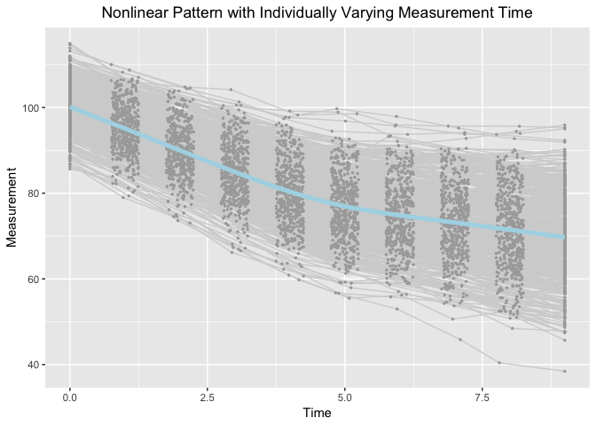

Estimating knots in BLSGMs w/o(w) TICs in the framework of individual measurement occasions
================
Jin Liu
2019/06/12

Require package would be used
-----------------------------

``` r
library(tidyr)
library(ggplot2)
```

    ## Registered S3 methods overwritten by 'ggplot2':
    ##   method         from 
    ##   [.quosures     rlang
    ##   c.quosures     rlang
    ##   print.quosures rlang

Read in dataset for analyses (wide-format data)
-----------------------------------------------

``` r
dat <- read.csv(file = "example_data.csv")
```

Summarize data
--------------

``` r
summary(dat)
```

    ##        id              Y1               Y2               Y3        
    ##  Min.   :  1.0   Min.   : 85.62   Min.   : 78.98   Min.   : 73.05  
    ##  1st Qu.:125.8   1st Qu.: 96.84   1st Qu.: 91.31   1st Qu.: 86.10  
    ##  Median :250.5   Median : 99.95   Median : 94.95   Median : 89.68  
    ##  Mean   :250.5   Mean   :100.14   Mean   : 95.10   Mean   : 90.04  
    ##  3rd Qu.:375.2   3rd Qu.:103.42   3rd Qu.: 98.75   3rd Qu.: 94.24  
    ##  Max.   :500.0   Max.   :114.93   Max.   :110.01   Max.   :104.79  
    ##        Y4               Y5              Y6              Y7       
    ##  Min.   : 66.18   Min.   :59.76   Min.   :55.48   Min.   :52.96  
    ##  1st Qu.: 80.69   1st Qu.:75.04   1st Qu.:71.45   1st Qu.:69.43  
    ##  Median : 84.89   Median :79.78   Median :76.59   Median :74.64  
    ##  Mean   : 85.13   Mean   :80.06   Mean   :76.73   Mean   :75.03  
    ##  3rd Qu.: 89.97   3rd Qu.:84.97   3rd Qu.:82.02   3rd Qu.:80.35  
    ##  Max.   :104.17   Max.   :99.16   Max.   :99.71   Max.   :97.90  
    ##        Y8              Y9             Y10              T1   
    ##  Min.   :45.82   Min.   :40.42   Min.   :38.43   Min.   :0  
    ##  1st Qu.:67.01   1st Qu.:64.77   1st Qu.:62.87   1st Qu.:0  
    ##  Median :73.03   Median :71.75   Median :69.77   Median :0  
    ##  Mean   :73.29   Mean   :71.39   Mean   :69.72   Mean   :0  
    ##  3rd Qu.:79.15   3rd Qu.:77.86   3rd Qu.:76.72   3rd Qu.:0  
    ##  Max.   :95.68   Max.   :95.62   Max.   :95.90   Max.   :0  
    ##        T2               T3              T4              T5       
    ##  Min.   :0.7504   Min.   :1.751   Min.   :2.750   Min.   :3.750  
    ##  1st Qu.:0.8691   1st Qu.:1.886   1st Qu.:2.885   1st Qu.:3.891  
    ##  Median :1.0158   Median :2.007   Median :2.998   Median :4.008  
    ##  Mean   :1.0056   Mean   :2.002   Mean   :3.002   Mean   :4.007  
    ##  3rd Qu.:1.1279   3rd Qu.:2.117   3rd Qu.:3.119   3rd Qu.:4.137  
    ##  Max.   :1.2493   Max.   :2.250   Max.   :3.250   Max.   :4.250  
    ##        T6              T7              T8              T9       
    ##  Min.   :4.751   Min.   :5.751   Min.   :6.751   Min.   :7.750  
    ##  1st Qu.:4.867   1st Qu.:5.855   1st Qu.:6.869   1st Qu.:7.891  
    ##  Median :4.990   Median :5.999   Median :6.995   Median :8.034  
    ##  Mean   :4.993   Mean   :5.990   Mean   :6.996   Mean   :8.015  
    ##  3rd Qu.:5.123   3rd Qu.:6.116   3rd Qu.:7.125   3rd Qu.:8.141  
    ##  Max.   :5.248   Max.   :6.250   Max.   :7.249   Max.   :8.250  
    ##       T10          x1                 x2          
    ##  Min.   :9   Min.   :-2.75128   Min.   :-3.42053  
    ##  1st Qu.:9   1st Qu.:-0.62326   1st Qu.:-0.59155  
    ##  Median :9   Median : 0.03191   Median : 0.05391  
    ##  Mean   :9   Mean   : 0.04213   Mean   : 0.03263  
    ##  3rd Qu.:9   3rd Qu.: 0.68883   3rd Qu.: 0.73213  
    ##  Max.   :9   Max.   : 2.61251   Max.   : 2.38615

Visualize data
--------------

``` r
long_dat_T <- gather(dat, var.T, time, T1:T10)
long_dat_Y <- gather(dat, var.Y, measures, Y1:Y10)
long_dat <- data.frame(id = long_dat_T[, 1], time = long_dat_T[, 15],
                       measures = long_dat_Y[, 15])
ggplot(aes(x = time, y = measures), data = long_dat) +
  geom_line(aes(group = id), color = "lightgrey") +
  geom_point(aes(group = id), color = "darkgrey", size = 0.5) +
  geom_smooth(aes(group = 1), size = 1.8, col = "lightblue", se = F) + 
  labs(title = "Nonlinear Pattern with Individually Varying Measurement Time",
       x ="Time", y = "Measurement") + 
  theme(plot.title = element_text(hjust = 0.5))
```

    ## `geom_smooth()` using method = 'gam' and formula 'y ~ s(x, bs = "cs")'



Bilinear Spline Growth Model with an Unknown Fixed Knot
-------------------------------------------------------

``` r
rm(list = ls()[-1])
source("BLSGM_fixed.R")
```

``` r
out
```

    ##         Name    Estimate         SE  true
    ## 1     mueta0 100.1293806 0.23173931 100.0
    ## 2     mueta1  -5.0073866 0.04598952  -5.0
    ## 3     mueta2  -1.7595551 0.04740980  -1.8
    ## 4        mug   4.4901427 0.01715132   4.5
    ## 5      psi00  26.2244244 1.69519279  25.0
    ## 6      psi01   1.2195304 0.23894008   1.5
    ## 7      psi02   0.8745634 0.24502789   1.5
    ## 8      psi11   0.9564964 0.06484603   1.0
    ## 9      psi12   0.2561488 0.04816303   0.3
    ## 10     psi22   1.0235957 0.06896813   1.0
    ## 11 residuals   1.0568444 0.02526431   1.0

Bilinear Spline Growth Model with an Unknown Random Knot
--------------------------------------------------------

``` r
rm(list = ls()[-1])
source("BLSGM_random.R")
```

``` r
out
```

    ##         Name     Estimate         SE   true
    ## 1     mueta0 100.13153949 0.22990826 100.00
    ## 2     mueta1  -5.00905302 0.04678657  -5.00
    ## 3     mueta2  -1.76048454 0.04849685  -1.80
    ## 4        mug   4.48745982 0.02127768   4.50
    ## 5      psi00  25.83588993 1.67158783  25.00
    ## 6      psi01   1.36661264 0.24615908   1.50
    ## 7      psi02   1.02785450 0.25351903   1.50
    ## 8      psi0g   0.34334931 0.11009416   0.45
    ## 9      psi11   0.99605990 0.06931131   1.00
    ## 10     psi12   0.29650754 0.05244601   0.30
    ## 11     psi1g   0.05323375 0.02354122   0.09
    ## 12     psi22   1.07807564 0.07441079   1.00
    ## 13     psi2g   0.06969967 0.02460247   0.09
    ## 14     psigg   0.07265694 0.01506738   0.09
    ## 15 residuals   0.98992408 0.02555569   1.00

Bilinear Spline Growth Model-TICs with an Unknown Fixed Knot
------------------------------------------------------------

``` r
rm(list = ls()[-1])
source("BLSGM_TICs_fixed.R")
```

``` r
out
```

    ##         Name     Estimate         SE        true
    ## 1     mueta0 100.05415269 0.22034610 100.0000000
    ## 2     mueta1  -5.01969088 0.04460011  -5.0000000
    ## 3     mueta2  -1.77336061 0.04566097  -1.8000000
    ## 4        mug   4.49042286 0.01715200   4.5000000
    ## 5      psi00  23.58531891 1.52810632  25.0000000
    ## 6      psi01   0.80706748 0.21671811   1.5000000
    ## 7      psi02   0.40611093 0.22124380   1.5000000
    ## 8      psi11   0.89100420 0.06056881   1.0000000
    ## 9      psi12   0.18204258 0.04430671   0.3000000
    ## 10     psi22   0.93976977 0.06367069   1.0000000
    ## 11    beta10   0.64071820 0.23686001   0.8849477
    ## 12    beta11   0.13140266 0.04713942   0.1769895
    ## 13    beta12   0.14120631 0.04837948   0.1769895
    ## 14    beta20   1.47445636 0.24080757   1.3274219
    ## 15    beta21   0.21131393 0.04792298   0.2654843
    ## 16    beta22   0.24500161 0.04914791   0.2654843
    ## 17      mux1   0.04213245 0.04246455   0.0000000
    ## 18      mux2   0.03262494 0.04180397   0.0000000
    ## 19     phi11   0.90180539 0.05702301   1.0000000
    ## 20     phi12   0.19521240 0.04064907   0.3000000
    ## 21     phi22   0.87395953 0.05526792   1.0000000
    ## 22 residuals   1.05683808 0.02526242   1.0000000

Bilinear Spline Growth Model-TICs with an Unknown Random Knot
-------------------------------------------------------------

``` r
rm(list = ls()[-4])
source("BLSGM_TICs_random.R")
```

``` r
out
```

    ##         Name     Estimate         SE         true
    ## 1     mueta0 100.05946360 0.21919470 100.00000000
    ## 2     mueta1  -5.02406800 0.04482452  -5.00000000
    ## 3     mueta2  -1.77713818 0.04614370  -1.80000000
    ## 4        mug   4.48208203 0.02081595   4.50000000
    ## 5      psi00  23.36758790 1.51541017  25.00000000
    ## 6      psi01   0.89796686 0.22118975   1.50000000
    ## 7      psi02   0.50148251 0.22671981   1.50000000
    ## 8      psi0g   0.19533139 0.10177348   0.45000000
    ## 9      psi11   0.90360208 0.06341721   1.00000000
    ## 10     psi12   0.19354342 0.04694721   0.30000000
    ## 11     psi1g   0.02158739 0.02183805   0.09000000
    ## 12     psi22   0.96392928 0.06717460   1.00000000
    ## 13     psi2g   0.03767500 0.02262081   0.09000000
    ## 14     psigg   0.06219057 0.01440263   0.09000000
    ## 15    beta10   0.59683351 0.23515276   0.88494767
    ## 16    beta11   0.16863253 0.04815006   0.17698953
    ## 17    beta12   0.17883636 0.04973575   0.17698953
    ## 18    beta1r   0.07641221 0.02245155   0.05309687
    ## 19    beta20   1.43909032 0.23974520   1.32742186
    ## 20    beta21   0.24121608 0.04903328   0.26548430
    ## 21    beta22   0.27576930 0.05053291   0.26548430
    ## 22    beta2r   0.06190572 0.02282968   0.07964533
    ## 23      mux1   0.04213258 0.04246387   0.00000000
    ## 24      mux2   0.03262513 0.04180492   0.00000000
    ## 25     phi11   0.90180612 0.05702412   1.00000000
    ## 26     phi12   0.19521249 0.04065039   0.30000000
    ## 27     phi22   0.87396034 0.05526382   1.00000000
    ## 28 residuals   0.98998294 0.02555726   1.00000000
