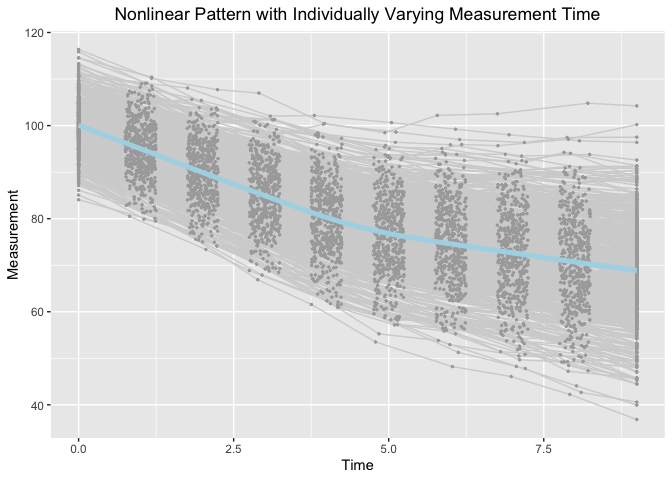

Estimating knots in BLSGMs w/o(w) TICs in the framework of individual
measurement occasions
================
Jin Liu
2020/12/21

## OS, R version and OpenMx Version

``` r
OpenMx::mxVersion()
```

    ## OpenMx version: 2.17.3 [GIT v2.17.3]
    ## R version: R version 3.6.3 (2020-02-29)
    ## Platform: x86_64-apple-darwin15.6.0 
    ## MacOS: 11.1
    ## Default optimizer: CSOLNP
    ## NPSOL-enabled?: No
    ## OpenMP-enabled?: Yes

## Require package would be used

``` r
library(tidyr)
library(ggplot2)
```

## Data set with positve knot variance

### Read in dataset for analyses (wide-format data)

``` r
dat <- read.csv(file = "Correctly_specified_knot_variance/example_data.csv")
```

### Summarize data

``` r
summary(dat)
```

    ##        id              Y1               Y2               Y3        
    ##  Min.   :  1.0   Min.   : 85.62   Min.   : 78.98   Min.   : 73.05  
    ##  1st Qu.:125.8   1st Qu.: 96.84   1st Qu.: 91.31   1st Qu.: 86.10  
    ##  Median :250.5   Median : 99.95   Median : 94.95   Median : 89.68  
    ##  Mean   :250.5   Mean   :100.14   Mean   : 95.10   Mean   : 90.04  
    ##  3rd Qu.:375.2   3rd Qu.:103.42   3rd Qu.: 98.75   3rd Qu.: 94.24  
    ##  Max.   :500.0   Max.   :114.93   Max.   :110.01   Max.   :104.79  
    ##        Y4               Y5              Y6              Y7       
    ##  Min.   : 66.18   Min.   :59.76   Min.   :55.48   Min.   :52.96  
    ##  1st Qu.: 80.69   1st Qu.:75.04   1st Qu.:71.45   1st Qu.:69.43  
    ##  Median : 84.89   Median :79.78   Median :76.59   Median :74.64  
    ##  Mean   : 85.13   Mean   :80.06   Mean   :76.73   Mean   :75.03  
    ##  3rd Qu.: 89.97   3rd Qu.:84.97   3rd Qu.:82.02   3rd Qu.:80.35  
    ##  Max.   :104.17   Max.   :99.16   Max.   :99.71   Max.   :97.90  
    ##        Y8              Y9             Y10              T1          T2        
    ##  Min.   :45.82   Min.   :40.42   Min.   :38.43   Min.   :0   Min.   :0.7504  
    ##  1st Qu.:67.01   1st Qu.:64.77   1st Qu.:62.87   1st Qu.:0   1st Qu.:0.8691  
    ##  Median :73.03   Median :71.75   Median :69.77   Median :0   Median :1.0158  
    ##  Mean   :73.29   Mean   :71.39   Mean   :69.72   Mean   :0   Mean   :1.0056  
    ##  3rd Qu.:79.15   3rd Qu.:77.86   3rd Qu.:76.72   3rd Qu.:0   3rd Qu.:1.1279  
    ##  Max.   :95.68   Max.   :95.62   Max.   :95.90   Max.   :0   Max.   :1.2493  
    ##        T3              T4              T5              T6       
    ##  Min.   :1.751   Min.   :2.750   Min.   :3.750   Min.   :4.751  
    ##  1st Qu.:1.886   1st Qu.:2.885   1st Qu.:3.891   1st Qu.:4.867  
    ##  Median :2.007   Median :2.998   Median :4.008   Median :4.990  
    ##  Mean   :2.002   Mean   :3.002   Mean   :4.007   Mean   :4.993  
    ##  3rd Qu.:2.117   3rd Qu.:3.119   3rd Qu.:4.137   3rd Qu.:5.123  
    ##  Max.   :2.250   Max.   :3.250   Max.   :4.250   Max.   :5.248  
    ##        T7              T8              T9             T10          x1          
    ##  Min.   :5.751   Min.   :6.751   Min.   :7.750   Min.   :9   Min.   :-2.75128  
    ##  1st Qu.:5.855   1st Qu.:6.869   1st Qu.:7.891   1st Qu.:9   1st Qu.:-0.62326  
    ##  Median :5.999   Median :6.995   Median :8.034   Median :9   Median : 0.03191  
    ##  Mean   :5.990   Mean   :6.996   Mean   :8.015   Mean   :9   Mean   : 0.04213  
    ##  3rd Qu.:6.116   3rd Qu.:7.125   3rd Qu.:8.141   3rd Qu.:9   3rd Qu.: 0.68883  
    ##  Max.   :6.250   Max.   :7.249   Max.   :8.250   Max.   :9   Max.   : 2.61251  
    ##        x2          
    ##  Min.   :-3.42053  
    ##  1st Qu.:-0.59155  
    ##  Median : 0.05391  
    ##  Mean   : 0.03263  
    ##  3rd Qu.: 0.73213  
    ##  Max.   : 2.38615

### Visualize data

``` r
long_dat_T <- gather(dat, var.T, time, T1:T10)
long_dat_Y <- gather(dat, var.Y, measures, Y1:Y10)
long_dat <- data.frame(id = long_dat_T[, 1], time = long_dat_T[, 15],
                       measures = long_dat_Y[, 15])
ggplot(aes(x = time, y = measures), data = long_dat) +
  geom_line(aes(group = id), color = "lightgrey") +
  geom_point(aes(group = id), color = "darkgrey", size = 0.5) +
  geom_smooth(aes(group = 1), size = 1.8, col = "lightblue", se = F) + 
  labs(title = "Nonlinear Pattern with Individually Varying Measurement Time",
       x ="Time", y = "Measurement") + 
  theme(plot.title = element_text(hjust = 0.5))
```

    ## `geom_smooth()` using method = 'gam' and formula 'y ~ s(x, bs = "cs")'

<!-- -->

### Bilinear Spline Growth Model with an Unknown Fixed Knot

``` r
source("Correctly_specified_knot_variance/BLSGM_fixed.R")
```

``` r
out
```

    ##      Name    Estimate         SE  true
    ## 1  mueta0 100.1293842 0.23173950 100.0
    ## 2  mueta1  -5.0073843 0.04598941  -5.0
    ## 3  mueta2  -1.7595553 0.04741006  -1.8
    ## 4     mug   4.4901431 0.01715132   4.5
    ## 5   psi00  26.2244482 1.69527344  25.0
    ## 8   psi11   0.9565026 0.06487324   1.0
    ## 10  psi22   1.0235966 0.06896477   1.0

### Bilinear Spline Growth Model with an Unknown Random Knot

``` r
source("Correctly_specified_knot_variance/BLSGM_random.R")
```

``` r
out
```

    ##      Name     Estimate         SE   true
    ## 1  mueta0 100.13153592 0.22990771 100.00
    ## 2  mueta1  -5.00905458 0.04678683  -5.00
    ## 3  mueta2  -1.76048620 0.04849630  -1.80
    ## 4     mug   4.48745907 0.02127750   4.50
    ## 5   psi00  25.83580908 1.67164593  25.00
    ## 9   psi11   0.99606011 0.06934476   1.00
    ## 12  psi22   1.07807896 0.07440719   1.00
    ## 14  psigg   0.07265711 0.01506795   0.09

### Bilinear Spline Growth Model with an Unknown Random Knot (constraint)

``` r
source("Correctly_specified_knot_variance/BLSGM_random_constraint.R")
```

``` r
out
```

    ##      Name     Estimate         SE   true
    ## 1  mueta0 100.13153288 0.22990821 100.00
    ## 2  mueta1  -5.00905461 0.04678754  -5.00
    ## 3  mueta2  -1.76048578 0.04849648  -1.80
    ## 4     mug   4.48745938 0.02127811   4.50
    ## 5   psi00  25.83591321 1.67153051  25.00
    ## 9   psi11   0.99605633 0.06936971   1.00
    ## 12  psi22   1.07807895 0.07438127   1.00
    ## 14  psigg   0.07265741 0.01506813   0.09

### Bilinear Spline Growth Model-TICs with an Unknown Fixed Knot

``` r
source("Correctly_specified_knot_variance/BLSGM_TICs_fixed.R")
```

``` r
out
```

    ##      Name    Estimate         SE        true
    ## 1  mueta0 100.0541638 0.22034721 100.0000000
    ## 2  mueta1  -5.0196891 0.04460106  -5.0000000
    ## 3  mueta2  -1.7733592 0.04566156  -1.8000000
    ## 4     mug   4.4904224 0.01715197   4.5000000
    ## 5   psi00  23.5853455 1.52824910  21.7500000
    ## 8   psi11   0.8910024 0.06064907   0.8700000
    ## 10  psi22   0.9397715 0.06366351   0.8700000
    ## 11 beta10   0.6407166 0.23749753   0.8849477
    ## 12 beta11   0.1314005 0.04724653   0.1769895
    ## 13 beta12   0.1412058 0.04838715   0.1769895
    ## 14 beta20   1.4744645 0.24116265   1.3274219
    ## 15 beta21   0.2113146 0.04798312   0.2654843
    ## 16 beta22   0.2450015 0.04915168   0.2654843

### Bilinear Spline Growth Model-TICs with an Unknown Random Knot

``` r
source("Correctly_specified_knot_variance/BLSGM_TICs_random.R")
```

``` r
out
```

    ##      Name     Estimate         SE         true
    ## 1  mueta0 100.05946709 0.21919703 100.00000000
    ## 2  mueta1  -5.02406753 0.04482660  -5.00000000
    ## 3  mueta2  -1.77713801 0.04614350  -1.80000000
    ## 4     mug   4.48208228 0.02081622   4.50000000
    ## 5   psi00  23.36764506 1.51545300  21.75000000
    ## 9   psi11   0.90360408 0.06346007   0.87000000
    ## 12  psi22   0.96392972 0.06716358   0.87000000
    ## 14  psigg   0.06219069 0.01440608   0.07830000
    ## 15 beta10   0.59683387 0.23629628   0.88494767
    ## 16 beta11   0.16863229 0.04832949   0.17698953
    ## 17 beta12   0.17883652 0.04973742   0.17698953
    ## 18 beta1r   0.07641211 0.02246073   0.05309687
    ## 19 beta20   1.43909744 0.24008285   1.32742186
    ## 20 beta21   0.24121713 0.04909168   0.26548430
    ## 21 beta22   0.27576955 0.05053722   0.26548430
    ## 22 beta2r   0.06190583 0.02283210   0.07964533

### Bilinear Spline Growth Model-TICs with an Unknown Random Knot (constraint)

``` r
source("Correctly_specified_knot_variance/BLSGM_TICs_random_constraint.R")
```

``` r
out
```

    ##      Name     Estimate         SE         true
    ## 1  mueta0 100.05946764 0.21920133 100.00000000
    ## 2  mueta1  -5.02406755 0.04482977  -5.00000000
    ## 3  mueta2  -1.77713813 0.04614470  -1.80000000
    ## 4     mug   4.48208250 0.02081793   4.50000000
    ## 5   psi00  23.36791428 1.51573591  21.75000000
    ## 9   psi11   0.90361255 0.06363136   0.87000000
    ## 12  psi22   0.96392986 0.06713828   0.87000000
    ## 14  psigg   0.06219079 0.01440805   0.07830000
    ## 15 beta10   0.59684199 0.23762349   0.88494767
    ## 16 beta11   0.16863362 0.04856312   0.17698953
    ## 17 beta12   0.17883658 0.04975732   0.17698953
    ## 18 beta1r   0.07641212 0.02246597   0.05309687
    ## 19 beta20   1.43909690 0.24067561   1.32742186
    ## 20 beta21   0.24121720 0.04921269   0.26548430
    ## 21 beta22   0.27577003 0.05054549   0.26548430
    ## 22 beta2r   0.06190548 0.02283568   0.07964533

## Data set with zero knot variance

### Read in dataset for analyses (wide-format data)

``` r
dat <- read.csv(file = "Over_specified_knot_variance/example_data.csv")
```

### Summarize data

``` r
summary(dat)
```

    ##        id              Y1               Y2               Y3        
    ##  Min.   :  1.0   Min.   : 83.68   Min.   : 77.26   Min.   : 70.15  
    ##  1st Qu.:125.8   1st Qu.: 96.20   1st Qu.: 91.05   1st Qu.: 85.66  
    ##  Median :250.5   Median :100.11   Median : 95.03   Median : 89.75  
    ##  Mean   :250.5   Mean   : 99.76   Mean   : 94.69   Mean   : 89.67  
    ##  3rd Qu.:375.2   3rd Qu.:103.12   3rd Qu.: 98.32   3rd Qu.: 93.78  
    ##  Max.   :500.0   Max.   :113.08   Max.   :111.64   Max.   :105.36  
    ##        Y4               Y5              Y6              Y7       
    ##  Min.   : 66.25   Min.   :52.17   Min.   :48.04   Min.   :45.99  
    ##  1st Qu.: 80.48   1st Qu.:74.83   1st Qu.:71.30   1st Qu.:69.50  
    ##  Median : 84.45   Median :79.91   Median :76.10   Median :74.63  
    ##  Mean   : 84.60   Mean   :79.69   Mean   :76.29   Mean   :74.61  
    ##  3rd Qu.: 89.05   3rd Qu.:84.30   3rd Qu.:81.68   3rd Qu.:80.16  
    ##  Max.   :105.37   Max.   :99.63   Max.   :99.92   Max.   :98.19  
    ##        Y8              Y9             Y10              T1          T2        
    ##  Min.   :43.35   Min.   :41.22   Min.   :39.43   Min.   :0   Min.   :0.5520  
    ##  1st Qu.:67.17   1st Qu.:64.62   1st Qu.:62.47   1st Qu.:0   1st Qu.:0.7734  
    ##  Median :72.85   Median :70.79   Median :69.11   Median :0   Median :0.9997  
    ##  Mean   :72.77   Mean   :70.80   Mean   :69.12   Mean   :0   Mean   :0.9999  
    ##  3rd Qu.:79.03   3rd Qu.:77.43   3rd Qu.:76.44   3rd Qu.:0   3rd Qu.:1.2080  
    ##  Max.   :99.95   Max.   :95.51   Max.   :96.70   Max.   :0   Max.   :1.4482  
    ##        T3              T4              T5              T6       
    ##  Min.   :1.552   Min.   :2.551   Min.   :3.551   Min.   :4.552  
    ##  1st Qu.:1.803   1st Qu.:2.791   1st Qu.:3.755   1st Qu.:4.778  
    ##  Median :2.028   Median :2.993   Median :3.994   Median :5.022  
    ##  Mean   :2.019   Mean   :3.003   Mean   :3.995   Mean   :5.010  
    ##  3rd Qu.:2.236   3rd Qu.:3.215   3rd Qu.:4.215   3rd Qu.:5.240  
    ##  Max.   :2.450   Max.   :3.445   Max.   :4.449   Max.   :5.445  
    ##        T7              T8              T9             T10   
    ##  Min.   :5.551   Min.   :6.552   Min.   :7.551   Min.   :9  
    ##  1st Qu.:5.789   1st Qu.:6.771   1st Qu.:7.808   1st Qu.:9  
    ##  Median :5.997   Median :6.970   Median :8.032   Median :9  
    ##  Mean   :5.997   Mean   :6.986   Mean   :8.017   Mean   :9  
    ##  3rd Qu.:6.205   3rd Qu.:7.194   3rd Qu.:8.246   3rd Qu.:9  
    ##  Max.   :6.449   Max.   :7.447   Max.   :8.450   Max.   :9  
    ##        x1                  x2           
    ##  Min.   :-2.777853   Min.   :-3.197675  
    ##  1st Qu.:-0.668876   1st Qu.:-0.654892  
    ##  Median : 0.005543   Median :-0.016528  
    ##  Mean   :-0.005593   Mean   : 0.002852  
    ##  3rd Qu.: 0.722139   3rd Qu.: 0.651067  
    ##  Max.   : 3.216293   Max.   : 3.925581

### Visualize data

``` r
long_dat_T <- gather(dat, var.T, time, T1:T10)
long_dat_Y <- gather(dat, var.Y, measures, Y1:Y10)
long_dat <- data.frame(id = long_dat_T[, 1], time = long_dat_T[, 15],
                       measures = long_dat_Y[, 15])
ggplot(aes(x = time, y = measures), data = long_dat) +
  geom_line(aes(group = id), color = "lightgrey") +
  geom_point(aes(group = id), color = "darkgrey", size = 0.5) +
  geom_smooth(aes(group = 1), size = 1.8, col = "lightblue", se = F) + 
  labs(title = "Nonlinear Pattern with Individually Varying Measurement Time",
       x ="Time", y = "Measurement") + 
  theme(plot.title = element_text(hjust = 0.5))
```

    ## `geom_smooth()` using method = 'gam' and formula 'y ~ s(x, bs = "cs")'

<!-- -->

### Bilinear Spline Growth Model with an Unknown Fixed Knot

``` r
source("Over_specified_knot_variance/BLSGM_fixed.R")
```

``` r
out
```

    ##      Name   Estimate         SE  true
    ## 1  mueta0 99.7484783 0.23617683 100.0
    ## 2  mueta1 -5.0276101 0.04786252  -5.0
    ## 3  mueta2 -1.8137577 0.04879421  -1.8
    ## 4     mug  4.4589269 0.02350092   4.5
    ## 5   psi00 26.7488735 1.75931450  25.0
    ## 8   psi11  0.9616408 0.06871474   1.0
    ## 10  psi22  1.0074857 0.07125829   1.0

### Bilinear Spline Growth Model with an Unknown Random Knot

``` r
source("Over_specified_knot_variance/BLSGM_random.R")
```

``` r
out
```

    ##      Name     Estimate         SE  true
    ## 1  mueta0 99.750714596 0.23669873 100.0
    ## 2  mueta1 -5.029459174 0.04733637  -5.0
    ## 3  mueta2 -1.815808374 0.04855664  -1.8
    ## 4     mug  4.454956030 0.02445424   4.5
    ## 5   psi00 26.859492134 1.77305925  25.0
    ## 9   psi11  0.929466233 0.07102844   1.0
    ## 12  psi22  0.988124605 0.07469688   1.0
    ## 14  psigg -0.007435077 0.02042985   0.0

### Bilinear Spline Growth Model with an Unknown Random Knot (constraint)

``` r
source("Over_specified_knot_variance/BLSGM_random_constraint.R")
```

    ## Warning: In model 'Estimate a random knot' Optimizer returned a non-zero status
    ## code 6. The model does not satisfy the first-order optimality conditions to the
    ## required accuracy, and no improved point for the merit function could be found
    ## during the final linesearch (Mx status RED)

``` r
out
```

    ##      Name      Estimate         SE  true
    ## 1  mueta0  9.975072e+01 0.23672380 100.0
    ## 2  mueta1 -5.029428e+00 0.04735700  -5.0
    ## 3  mueta2 -1.815761e+00 0.04858744  -1.8
    ## 4     mug  4.454998e+00 0.02475073   4.5
    ## 5   psi00  2.686867e+01 1.77327643  25.0
    ## 9   psi11  9.309944e-01 0.07097971   1.0
    ## 12  psi22  9.900622e-01 0.07468989   1.0
    ## 14  psigg  7.833530e-08 0.00000000   0.0

### Bilinear Spline Growth Model-TICs with an Unknown Fixed Knot

``` r
source("Over_specified_knot_variance/BLSGM_TICs_fixed.R")
```

``` r
out
```

    ##      Name   Estimate         SE        true
    ## 1  mueta0 99.7521306 0.21506868 100.0000000
    ## 2  mueta1 -5.0275111 0.04460962  -5.0000000
    ## 3  mueta2 -1.8134736 0.04607395  -1.8000000
    ## 4     mug  4.4590046 0.02350049   4.5000000
    ## 5   psi00 21.9851843 1.45821839  21.7500000
    ## 8   psi11  0.8111671 0.05927043   0.8700000
    ## 10  psi22  0.8783769 0.06312882   0.8700000
    ## 11 beta10  1.3287531 0.21975146   0.8849477
    ## 12 beta11  0.1646515 0.04419494   0.1769895
    ## 13 beta12  0.1737405 0.04563516   0.1769895
    ## 14 beta20  1.3334962 0.21824770   1.3274219
    ## 15 beta21  0.2972621 0.04390836   0.2654843
    ## 16 beta22  0.2595285 0.04529005   0.2654843

### Bilinear Spline Growth Model-TICs with an Unknown Random Knot

``` r
source("Over_specified_knot_variance/BLSGM_TICs_random.R")
```

``` r
out
```

    ##      Name     Estimate         SE        true
    ## 1  mueta0 99.754416222 0.21555900 100.0000000
    ## 2  mueta1 -5.029373890 0.04411678  -5.0000000
    ## 3  mueta2 -1.815557089 0.04588805  -1.8000000
    ## 4     mug  4.454998980 0.02444280   4.5000000
    ## 5   psi00 22.077941611 1.47052916  21.7500000
    ## 9   psi11  0.782180501 0.06179974   0.8700000
    ## 12  psi22  0.862031700 0.06673012   0.8700000
    ## 14  psigg -0.007713081 0.02041502   0.0000000
    ## 15 beta10  1.327239897 0.22037424   0.8849477
    ## 16 beta11  0.166012381 0.04505169   0.1769895
    ## 17 beta12  0.175074484 0.04701944   0.1769895
    ## 18 beta1r  0.002805514 0.02502849   0.0000000
    ## 19 beta20  1.340058867 0.21900099   1.3274219
    ## 20 beta21  0.291771252 0.04482820   0.2654843
    ## 21 beta22  0.253946594 0.04660778   0.2654843
    ## 22 beta2r -0.011388833 0.02478596   0.0000000

### Bilinear Spline Growth Model-TICs with an Unknown Random Knot (constraint)

``` r
source("Over_specified_knot_variance/BLSGM_TICs_random_constraint.R")
```

``` r
out
```

    ##      Name      Estimate         SE        true
    ## 1  mueta0  9.975440e+01 0.21558801 100.0000000
    ## 2  mueta1 -5.029343e+00 0.04415049  -5.0000000
    ## 3  mueta2 -1.815508e+00 0.04592387  -1.8000000
    ## 4     mug  4.455046e+00 0.02475789   4.5000000
    ## 5   psi00  2.208698e+01 1.47286920  21.7500000
    ## 9   psi11  7.838310e-01 0.06255841   0.8700000
    ## 12  psi22  8.641609e-01 0.06653157   0.8700000
    ## 14  psigg  8.307684e-10 0.00000000   0.0000000
    ## 15 beta10  1.327271e+00 0.22258933   0.8849477
    ## 16 beta11  1.659501e-01 0.04548603   0.1769895
    ## 17 beta12  1.750457e-01 0.04708996   0.1769895
    ## 18 beta1r  2.704624e-03 0.02531812   0.0000000
    ## 19 beta20  1.340021e+00 0.22050127   1.3274219
    ## 20 beta21  2.918034e-01 0.04514056   0.2654843
    ## 21 beta22  2.538809e-01 0.04668099   0.2654843
    ## 22 beta2r -1.142925e-02 0.02507568   0.0000000
