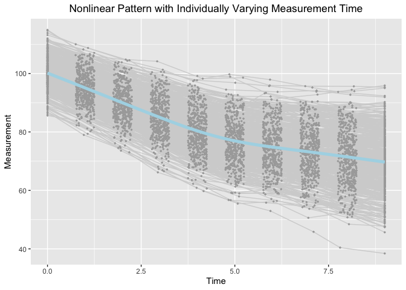

Estimating knots in BLSGMs w/o(w) TICs in the framework of individual measurement occasions
================
Jin Liu
2019/10/01

OS, R version and OpenMx Version
--------------------------------

``` r
OpenMx::mxVersion()
```

    ## OpenMx version: 2.14.11 [GIT v2.14.11]
    ## R version: R version 3.6.1 (2019-07-05)
    ## Platform: x86_64-apple-darwin15.6.0 
    ## MacOS: 10.14.6
    ## Default optimizer: CSOLNP
    ## NPSOL-enabled?: No
    ## OpenMP-enabled?: Yes

Require package would be used
-----------------------------

``` r
library(tidyr)
library(ggplot2)
```

Read in dataset for analyses (wide-format data)
-----------------------------------------------

``` r
dat <- read.csv(file = "example_data.csv")
```

Summarize data
--------------

``` r
summary(dat)
```

    ##        id              Y1               Y2               Y3        
    ##  Min.   :  1.0   Min.   : 85.62   Min.   : 78.98   Min.   : 73.05  
    ##  1st Qu.:125.8   1st Qu.: 96.84   1st Qu.: 91.31   1st Qu.: 86.10  
    ##  Median :250.5   Median : 99.95   Median : 94.95   Median : 89.68  
    ##  Mean   :250.5   Mean   :100.14   Mean   : 95.10   Mean   : 90.04  
    ##  3rd Qu.:375.2   3rd Qu.:103.42   3rd Qu.: 98.75   3rd Qu.: 94.24  
    ##  Max.   :500.0   Max.   :114.93   Max.   :110.01   Max.   :104.79  
    ##        Y4               Y5              Y6              Y7       
    ##  Min.   : 66.18   Min.   :59.76   Min.   :55.48   Min.   :52.96  
    ##  1st Qu.: 80.69   1st Qu.:75.04   1st Qu.:71.45   1st Qu.:69.43  
    ##  Median : 84.89   Median :79.78   Median :76.59   Median :74.64  
    ##  Mean   : 85.13   Mean   :80.06   Mean   :76.73   Mean   :75.03  
    ##  3rd Qu.: 89.97   3rd Qu.:84.97   3rd Qu.:82.02   3rd Qu.:80.35  
    ##  Max.   :104.17   Max.   :99.16   Max.   :99.71   Max.   :97.90  
    ##        Y8              Y9             Y10              T1   
    ##  Min.   :45.82   Min.   :40.42   Min.   :38.43   Min.   :0  
    ##  1st Qu.:67.01   1st Qu.:64.77   1st Qu.:62.87   1st Qu.:0  
    ##  Median :73.03   Median :71.75   Median :69.77   Median :0  
    ##  Mean   :73.29   Mean   :71.39   Mean   :69.72   Mean   :0  
    ##  3rd Qu.:79.15   3rd Qu.:77.86   3rd Qu.:76.72   3rd Qu.:0  
    ##  Max.   :95.68   Max.   :95.62   Max.   :95.90   Max.   :0  
    ##        T2               T3              T4              T5       
    ##  Min.   :0.7504   Min.   :1.751   Min.   :2.750   Min.   :3.750  
    ##  1st Qu.:0.8691   1st Qu.:1.886   1st Qu.:2.885   1st Qu.:3.891  
    ##  Median :1.0158   Median :2.007   Median :2.998   Median :4.008  
    ##  Mean   :1.0056   Mean   :2.002   Mean   :3.002   Mean   :4.007  
    ##  3rd Qu.:1.1279   3rd Qu.:2.117   3rd Qu.:3.119   3rd Qu.:4.137  
    ##  Max.   :1.2493   Max.   :2.250   Max.   :3.250   Max.   :4.250  
    ##        T6              T7              T8              T9       
    ##  Min.   :4.751   Min.   :5.751   Min.   :6.751   Min.   :7.750  
    ##  1st Qu.:4.867   1st Qu.:5.855   1st Qu.:6.869   1st Qu.:7.891  
    ##  Median :4.990   Median :5.999   Median :6.995   Median :8.034  
    ##  Mean   :4.993   Mean   :5.990   Mean   :6.996   Mean   :8.015  
    ##  3rd Qu.:5.123   3rd Qu.:6.116   3rd Qu.:7.125   3rd Qu.:8.141  
    ##  Max.   :5.248   Max.   :6.250   Max.   :7.249   Max.   :8.250  
    ##       T10          x1                 x2          
    ##  Min.   :9   Min.   :-2.75128   Min.   :-3.42053  
    ##  1st Qu.:9   1st Qu.:-0.62326   1st Qu.:-0.59155  
    ##  Median :9   Median : 0.03191   Median : 0.05391  
    ##  Mean   :9   Mean   : 0.04213   Mean   : 0.03263  
    ##  3rd Qu.:9   3rd Qu.: 0.68883   3rd Qu.: 0.73213  
    ##  Max.   :9   Max.   : 2.61251   Max.   : 2.38615

Visualize data
--------------

``` r
long_dat_T <- gather(dat, var.T, time, T1:T10)
long_dat_Y <- gather(dat, var.Y, measures, Y1:Y10)
long_dat <- data.frame(id = long_dat_T[, 1], time = long_dat_T[, 15],
                       measures = long_dat_Y[, 15])
ggplot(aes(x = time, y = measures), data = long_dat) +
  geom_line(aes(group = id), color = "lightgrey") +
  geom_point(aes(group = id), color = "darkgrey", size = 0.5) +
  geom_smooth(aes(group = 1), size = 1.8, col = "lightblue", se = F) + 
  labs(title = "Nonlinear Pattern with Individually Varying Measurement Time",
       x ="Time", y = "Measurement") + 
  theme(plot.title = element_text(hjust = 0.5))
```

    ## `geom_smooth()` using method = 'gam' and formula 'y ~ s(x, bs = "cs")'



Bilinear Spline Growth Model with an Unknown Fixed Knot
-------------------------------------------------------

``` r
source("BLSGM_fixed.R")
```

``` r
out
```

    ##      Name    Estimate         SE  true
    ## 1  mueta0 100.1293861 0.23173918 100.0
    ## 2  mueta1  -5.0073865 0.04598832  -5.0
    ## 3  mueta2  -1.7595555 0.04740985  -1.8
    ## 4     mug   4.4901420 0.01715134   4.5
    ## 5   psi00  26.2244323 1.69511798  25.0
    ## 8   psi11   0.9564971 0.06482577   1.0
    ## 10  psi22   1.0235951 0.06897312   1.0

Bilinear Spline Growth Model with an Unknown Random Knot
--------------------------------------------------------

``` r
source("BLSGM_random.R")
```

``` r
out
```

    ##      Name     Estimate         SE   true
    ## 1  mueta0 100.13153114 0.22990749 100.00
    ## 2  mueta1  -5.00905557 0.04678665  -5.00
    ## 3  mueta2  -1.76048645 0.04849627  -1.80
    ## 4     mug   4.48745886 0.02127796   4.50
    ## 5   psi00  25.83580351 1.67155933  25.00
    ## 9   psi11   0.99605467 0.06935629   1.00
    ## 12  psi22   1.07807698 0.07439648   1.00
    ## 14  psigg   0.07265726 0.01506845   0.09

Bilinear Spline Growth Model-TICs with an Unknown Fixed Knot
------------------------------------------------------------

``` r
source("BLSGM_TICs_fixed.R")
```

``` r
out
```

    ##      Name    Estimate         SE        true
    ## 1  mueta0 100.0541528 0.22034720 100.0000000
    ## 2  mueta1  -5.0196912 0.04460125  -5.0000000
    ## 3  mueta2  -1.7733610 0.04566152  -1.8000000
    ## 4     mug   4.4904223 0.01715193   4.5000000
    ## 5   psi00  23.5854076 1.52831026  21.7500000
    ## 8   psi11   0.8910060 0.06066537   0.8700000
    ## 10  psi22   0.9397712 0.06366393   0.8700000
    ## 11 beta10   0.6407199 0.23741508   0.8849477
    ## 12 beta11   0.1314019 0.04722626   0.1769895
    ## 13 beta12   0.1412064 0.04838696   0.1769895
    ## 14 beta20   1.4744469 0.24124420   1.3274219
    ## 15 beta21   0.2113124 0.04799137   0.2654843
    ## 16 beta22   0.2450006 0.04915186   0.2654843

Bilinear Spline Growth Model-TICs with an Unknown Random Knot
-------------------------------------------------------------

``` r
source("BLSGM_TICs_random.R")
```

``` r
out
```

    ##      Name     Estimate         SE         true
    ## 1  mueta0 100.05946376 0.21919679 100.00000000
    ## 2  mueta1  -5.02406870 0.04482632  -5.00000000
    ## 3  mueta2  -1.77713691 0.04614378  -1.80000000
    ## 4     mug   4.48208250 0.02081637   4.50000000
    ## 5   psi00  23.36782410 1.51549357  21.75000000
    ## 9   psi11   0.90360826 0.06346951   0.87000000
    ## 12  psi22   0.96392982 0.06716448   0.87000000
    ## 14  psigg   0.06219080 0.01440547   0.07830000
    ## 15 beta10   0.59683964 0.23553487   0.88494767
    ## 16 beta11   0.16863322 0.04820763   0.17698953
    ## 17 beta12   0.17883630 0.04973808   0.17698953
    ## 18 beta1r   0.07641199 0.02245500   0.05309687
    ## 19 beta20   1.43909337 0.23985663   1.32742186
    ## 20 beta21   0.24121738 0.04905602   0.26548430
    ## 21 beta22   0.27577000 0.05053432   0.26548430
    ## 22 beta2r   0.06190583 0.02283148   0.07964533
