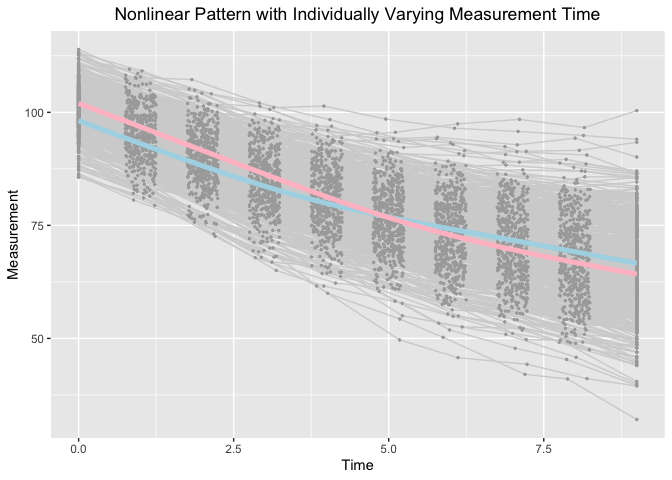

Estimating knots in BLSGMMs in the framework of individual measurement occasions
================
Jin Liu
2019/10/02

OS, R version and OpenMx Version
--------------------------------

``` r
OpenMx::mxVersion()
```

    ## OpenMx version: 2.14.11 [GIT v2.14.11]
    ## R version: R version 3.6.1 (2019-07-05)
    ## Platform: x86_64-apple-darwin15.6.0 
    ## MacOS: 10.14.6
    ## Default optimizer: CSOLNP
    ## NPSOL-enabled?: No
    ## OpenMP-enabled?: Yes

Require package would be used
-----------------------------

``` r
library(tidyr)
library(ggplot2)
```

Read in dataset for analyses (wide-format data)
-----------------------------------------------

``` r
dat <- read.csv(file = "example_data.csv")
```

Summarize data
--------------

``` r
table(dat$class)
```

    ## 
    ##   1   2 
    ## 243 257

``` r
summary(dat[dat$class == 1, ])
```

    ##        id              Y1               Y2               Y3        
    ##  Min.   :  2.0   Min.   : 85.64   Min.   : 79.42   Min.   : 72.58  
    ##  1st Qu.:126.0   1st Qu.: 95.08   1st Qu.: 90.45   1st Qu.: 84.64  
    ##  Median :252.0   Median : 98.29   Median : 93.51   Median : 88.02  
    ##  Mean   :251.6   Mean   : 98.32   Mean   : 93.35   Mean   : 88.27  
    ##  3rd Qu.:374.5   3rd Qu.:101.69   3rd Qu.: 96.67   3rd Qu.: 91.99  
    ##  Max.   :498.0   Max.   :112.66   Max.   :108.22   Max.   :105.13  
    ##        Y4              Y5              Y6              Y7       
    ##  Min.   :65.04   Min.   :61.58   Min.   :57.77   Min.   :53.36  
    ##  1st Qu.:79.08   1st Qu.:74.71   1st Qu.:72.68   1st Qu.:69.17  
    ##  Median :83.55   Median :79.08   Median :76.76   Median :74.46  
    ##  Mean   :83.29   Mean   :79.47   Mean   :76.90   Mean   :74.46  
    ##  3rd Qu.:87.87   3rd Qu.:84.17   3rd Qu.:81.94   3rd Qu.:79.78  
    ##  Max.   :99.62   Max.   :96.94   Max.   :95.57   Max.   :97.45  
    ##        Y8              Y9             Y10               T1   
    ##  Min.   :49.75   Min.   :45.83   Min.   : 40.01   Min.   :0  
    ##  1st Qu.:65.80   1st Qu.:62.91   1st Qu.: 59.62   1st Qu.:0  
    ##  Median :71.83   Median :69.26   Median : 66.74   Median :0  
    ##  Mean   :71.72   Mean   :69.17   Mean   : 66.58   Mean   :0  
    ##  3rd Qu.:77.99   3rd Qu.:75.84   3rd Qu.: 73.88   3rd Qu.:0  
    ##  Max.   :98.45   Max.   :96.63   Max.   :100.38   Max.   :0  
    ##        T2               T3              T4              T5       
    ##  Min.   :0.7525   Min.   :1.761   Min.   :2.753   Min.   :3.752  
    ##  1st Qu.:0.8625   1st Qu.:1.902   1st Qu.:2.889   1st Qu.:3.883  
    ##  Median :0.9832   Median :2.008   Median :3.030   Median :4.002  
    ##  Mean   :0.9918   Mean   :2.009   Mean   :3.014   Mean   :4.003  
    ##  3rd Qu.:1.1239   3rd Qu.:2.116   3rd Qu.:3.130   3rd Qu.:4.125  
    ##  Max.   :1.2453   Max.   :2.249   Max.   :3.247   Max.   :4.250  
    ##        T6              T7              T8              T9       
    ##  Min.   :4.750   Min.   :5.751   Min.   :6.753   Min.   :7.751  
    ##  1st Qu.:4.864   1st Qu.:5.871   1st Qu.:6.884   1st Qu.:7.863  
    ##  Median :5.006   Median :5.993   Median :6.992   Median :7.997  
    ##  Mean   :5.000   Mean   :5.989   Mean   :6.999   Mean   :7.990  
    ##  3rd Qu.:5.141   3rd Qu.:6.111   3rd Qu.:7.112   3rd Qu.:8.109  
    ##  Max.   :5.247   Max.   :6.249   Max.   :7.249   Max.   :8.245  
    ##       T10          x1                x2              class  
    ##  Min.   :9   Min.   :-2.5795   Min.   :-2.6091   Min.   :1  
    ##  1st Qu.:9   1st Qu.:-0.9063   1st Qu.:-0.8708   1st Qu.:1  
    ##  Median :9   Median :-0.1603   Median :-0.3009   Median :1  
    ##  Mean   :9   Mean   :-0.1799   Mean   :-0.2075   Mean   :1  
    ##  3rd Qu.:9   3rd Qu.: 0.5079   3rd Qu.: 0.4898   3rd Qu.:1  
    ##  Max.   :9   Max.   : 2.6054   Max.   : 2.9942   Max.   :1

``` r
summary(dat[dat$class == 2, ])
```

    ##        id              Y1               Y2               Y3        
    ##  Min.   :  1.0   Min.   : 89.54   Min.   : 82.34   Min.   : 75.55  
    ##  1st Qu.:126.0   1st Qu.: 98.36   1st Qu.: 93.33   1st Qu.: 87.82  
    ##  Median :250.0   Median :102.03   Median : 97.22   Median : 91.74  
    ##  Mean   :249.5   Mean   :102.00   Mean   : 96.94   Mean   : 91.73  
    ##  3rd Qu.:375.0   3rd Qu.:105.45   3rd Qu.:101.27   3rd Qu.: 95.65  
    ##  Max.   :500.0   Max.   :113.92   Max.   :109.53   Max.   :107.25  
    ##        Y4               Y5               Y6              Y7       
    ##  Min.   : 67.94   Min.   : 59.97   Min.   :49.66   Min.   :45.75  
    ##  1st Qu.: 82.30   1st Qu.: 76.78   1st Qu.:70.91   1st Qu.:66.36  
    ##  Median : 86.84   Median : 81.56   Median :76.43   Median :72.35  
    ##  Mean   : 86.55   Mean   : 81.56   Mean   :76.33   Mean   :72.38  
    ##  3rd Qu.: 90.97   3rd Qu.: 86.32   3rd Qu.:81.65   3rd Qu.:78.59  
    ##  Max.   :102.05   Max.   :101.39   Max.   :98.51   Max.   :96.48  
    ##        Y8              Y9             Y10              T1   
    ##  Min.   :42.06   Min.   :41.02   Min.   :32.06   Min.   :0  
    ##  1st Qu.:63.65   1st Qu.:59.95   1st Qu.:57.54   1st Qu.:0  
    ##  Median :70.35   Median :66.89   Median :64.25   Median :0  
    ##  Mean   :69.63   Mean   :66.97   Mean   :64.30   Mean   :0  
    ##  3rd Qu.:75.74   3rd Qu.:73.27   3rd Qu.:71.03   3rd Qu.:0  
    ##  Max.   :95.77   Max.   :94.88   Max.   :94.03   Max.   :0  
    ##        T2               T3              T4              T5       
    ##  Min.   :0.7542   Min.   :1.750   Min.   :2.750   Min.   :3.752  
    ##  1st Qu.:0.8743   1st Qu.:1.878   1st Qu.:2.871   1st Qu.:3.859  
    ##  Median :0.9878   Median :2.007   Median :2.979   Median :4.002  
    ##  Mean   :1.0011   Mean   :1.999   Mean   :2.991   Mean   :3.994  
    ##  3rd Qu.:1.1486   3rd Qu.:2.107   3rd Qu.:3.119   3rd Qu.:4.128  
    ##  Max.   :1.2489   Max.   :2.248   Max.   :3.248   Max.   :4.249  
    ##        T6              T7              T8              T9       
    ##  Min.   :4.750   Min.   :5.752   Min.   :6.750   Min.   :7.754  
    ##  1st Qu.:4.866   1st Qu.:5.891   1st Qu.:6.877   1st Qu.:7.874  
    ##  Median :5.019   Median :6.009   Median :6.985   Median :7.992  
    ##  Mean   :5.002   Mean   :6.004   Mean   :6.999   Mean   :7.997  
    ##  3rd Qu.:5.130   3rd Qu.:6.123   3rd Qu.:7.134   3rd Qu.:8.115  
    ##  Max.   :5.237   Max.   :6.248   Max.   :7.246   Max.   :8.247  
    ##       T10          x1                x2              class  
    ##  Min.   :9   Min.   :-2.8460   Min.   :-2.3684   Min.   :2  
    ##  1st Qu.:9   1st Qu.:-0.2748   1st Qu.:-0.2324   1st Qu.:2  
    ##  Median :9   Median : 0.3706   Median : 0.4325   Median :2  
    ##  Mean   :9   Mean   : 0.3293   Mean   : 0.3868   Mean   :2  
    ##  3rd Qu.:9   3rd Qu.: 0.9533   3rd Qu.: 0.9860   3rd Qu.:2  
    ##  Max.   :9   Max.   : 2.6135   Max.   : 2.6051   Max.   :2

Visualize data
--------------

``` r
long_dat_T <- gather(dat, var.T, time, T1:T10)
long_dat_Y <- gather(dat, var.Y, measures, Y1:Y10)
long_dat <- data.frame(id = long_dat_T[, "id"], time = long_dat_T[, "time"],
                       measures = long_dat_Y[, "measures"], class = long_dat_Y[, "class"])
ggplot(aes(x = time, y = measures), data = long_dat) +
  geom_line(aes(group = id), color = "lightgrey", data = long_dat) +
  geom_point(aes(group = id), color = "darkgrey", size = 0.5) +
  geom_smooth(aes(group = 1), size = 1.8, col = "lightblue", se = F, 
              data = long_dat[long_dat$class == 1, ] ) + 
  geom_smooth(aes(group = 1), size = 1.8, col = "pink", se = F, 
              data = long_dat[long_dat$class == 2, ] ) + 
  labs(title = "Nonlinear Pattern with Individually Varying Measurement Time",
       x ="Time", y = "Measurement") + 
  theme(plot.title = element_text(hjust = 0.5))
```

    ## `geom_smooth()` using method = 'gam' and formula 'y ~ s(x, bs = "cs")'
    ## `geom_smooth()` using method = 'gam' and formula 'y ~ s(x, bs = "cs")'



Bilinear Spline Growth Mixture Model with Unknown Fixed Knots
-------------------------------------------------------------

``` r
rm(list = ls())
dat <- read.csv(file = "example_data.csv")
c <- 2
source("BLSGMM_fixed_2steps.R")
```

``` r
Step1.out
```

    ##           Name    Estimate         SE  True
    ## 1     c1mueta0  98.5298892 0.37499647  98.0
    ## 2     c1mueta1  -4.9330059 0.07409552  -5.0
    ## 3     c1mueta2  -2.6195334 0.08558541  -2.6
    ## 4        c1mug   3.5524336 0.03550151   3.5
    ## 5      c1psi00  23.9530114 2.33080790  25.0
    ## 6      c1psi01   1.4882801 0.35450345   1.5
    ## 7      c1psi02   1.2302560 0.41327345   1.5
    ## 8      c1psi11   0.9309758 0.09787144   1.0
    ## 9      c1psi12   0.2217765 0.07618427   0.3
    ## 10     c1psi22   0.9850564 0.11515008   1.0
    ## 11 c1residuals   1.0969293 0.03970949   1.0
    ## 12    c2mueta0 102.0479567 0.35684517 102.0
    ## 13    c2mueta1  -5.2071035 0.07918322  -5.0
    ## 14    c2mueta2  -2.6801871 0.09124741  -2.6
    ## 15       c2mug   5.5448984 0.03359297   5.5
    ## 16     c2psi00  22.6434473 2.31794808  25.0
    ## 17     c2psi01   1.3480636 0.34699209   1.5
    ## 18     c2psi02   1.7894653 0.39076431   1.5
    ## 19     c2psi11   0.8127255 0.09653362   1.0
    ## 20     c2psi12   0.1976081 0.08056434   0.3
    ## 21     c2psi22   1.0203204 0.11994198   1.0
    ## 22 c2residuals   1.0237297 0.03880120   1.0
    ## 23          p2   0.9112901 0.13347941   1.0

``` r
Step2.out
```

    ##     Name   Estimate        SE      True
    ## 1 beta20 -0.1605946 0.1115451 0.0000000
    ## 2 beta21  0.3101448 0.1185735 0.4054651
    ## 3 beta22  0.5694397 0.1274057 0.5306283

``` r
rm(list = ls())
dat <- read.csv(file = "example_data.csv")
c <- 2
source("BLSGMM_fixed_1step.R")
```

``` r
Step.out
```

    ##           Name    Estimate         SE        True
    ## 1     c1mueta0  98.4543045 0.35546491  98.0000000
    ## 2     c1mueta1  -4.9878720 0.07654418  -5.0000000
    ## 3     c1mueta2  -2.6193399 0.07921593  -2.6000000
    ## 4        c1mug   3.5473262 0.03527419   3.5000000
    ## 5      c1psi00  23.5127552 2.28915957  25.0000000
    ## 6      c1psi01   1.3780047 0.36035455   1.5000000
    ## 7      c1psi02   1.2731907 0.38411187   1.5000000
    ## 8      c1psi11   0.9245500 0.10200396   1.0000000
    ## 9      c1psi12   0.2544604 0.07963516   0.3000000
    ## 10     c1psi22   1.0159958 0.11235768   1.0000000
    ## 11 c1residuals   1.0924080 0.03954299   1.0000000
    ## 12    c2mueta0 101.9995062 0.35332251 102.0000000
    ## 13    c2mueta1  -5.1380046 0.07690598  -5.0000000
    ## 14    c2mueta2  -2.6662626 0.08112640  -2.6000000
    ## 15       c2mug   5.5481050 0.03313726   5.5000000
    ## 16     c2psi00  23.0049891 2.34965800  25.0000000
    ## 17     c2psi01   1.2334081 0.36300287   1.5000000
    ## 18     c2psi02   1.6789506 0.37909316   1.5000000
    ## 19     c2psi11   0.8876707 0.10212076   1.0000000
    ## 20     c2psi12   0.1991588 0.07678976   0.3000000
    ## 21     c2psi22   1.0063428 0.11227959   1.0000000
    ## 22 c2residuals   1.0201319 0.03761991   1.0000000
    ## 23      beta20  -0.1113019 0.13298989   0.0000000
    ## 24      beta21   0.3271039 0.12239876   0.4054651
    ## 25      beta22   0.6042530 0.13409937   0.5306283
