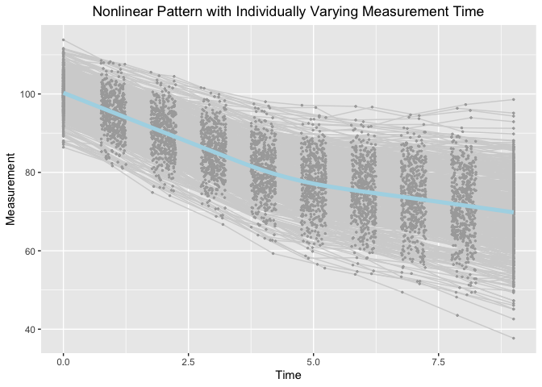

Estimating knots in BLSGMs w/o(w) TICs in the framework of individual
measurement occasions
================
Jin Liu
2021/11/21

## Require package would be used

``` r
library(OpenMx)
```

    ## OpenMx may run faster if it is compiled to take advantage of multiple cores.

``` r
library(tidyr)
library(ggplot2)
```

## OS, R version and OpenMx Version

``` r
mxOption(model = NULL, key = "Default optimizer", "CSOLNP", reset = FALSE)
mxVersion()
```

    ## OpenMx version: 2.19.6 [GIT v2.19.6]
    ## R version: R version 4.1.0 (2021-05-18)
    ## Platform: x86_64-apple-darwin17.0 
    ## MacOS: 12.0.1
    ## Default optimizer: CSOLNP
    ## NPSOL-enabled?: No
    ## OpenMP-enabled?: No

## “True” values of parameters

``` r
### Population values of growth factor means
# meanY0 <- c(100, -5, -1.8, 4.5)
### Population values of growth factor var-cov matrix
# psiY0 <- matrix(c(25, 1.5, 1.5, 0.45,
#                   1.5, 1.0, 0.3, 0.09,
#                   1.5, 0.3, 1.0, 0.09,
#                   0.45, 0.09, 0.09, 0.09), nrow = 4)
### Population values of TIC means
# meanX0 <- c(0, 0)
### Population values of growth factor var-cov matrix
# phi0 <- matrix(c(1, 0.3, 0.3, 1), nrow = 2)
### Population values path coefficients
# betaXtoY <- matrix(c(0.88494767, 1.32742186, 
#                      0.17698953, 0.26548430, 
#                      0.17698953, 0.26548430, 
#                      0.05309687, 0.07964533), byrow = T, nrow = 4)
### Population values of unexplained var-cov matrix
# psiY0 - betaXtoY %*% phi0 %*% t(betaXtoY) is
# matrix(c(21.7499995, 0.85000002, 0.85000002, 0.25499993, 
#          0.8500000, 0.87000003, 0.17000003, 0.05099999, 
#          0.8500000, 0.17000003, 0.87000003, 0.05099999, 
#          0.2549999, 0.05099999, 0.05099999, 0.07829999), byrow = T, nrow = 4)
```

## Define Parameter lists

``` r
### Bilinear spline with a fixed knot
paraFixed <- c("mueta0", "mueta1", "mueta2", "mug",
               paste0("psi", c("00", "01", "02", "11", "12", "22")),
               "residuals")
### Bilinear spline with a random knot
paraRandom <- c("mueta0", "mueta1", "mueta2", "mug",
                paste0("psi", c("00", "01", "02", "0g", "11", "12", "1g", "22", "2g", "gg")),
                "residuals")
### Bilinear spline with a fixed knot and two baseline covariates
paraFixedTIC <- c("mueta0", "mueta1", "mueta2", "mug",
                  paste0("psi", c("00", "01", "02", "11", "12", "22")),
                  paste0("beta1", 0:2), paste0("beta2", 0:2),
                  paste0("mux", 1:2), paste0("phi", c("11", "12", "22")),
                  "residuals")
### Bilinear spline with a random knot and two baseline covariates
paraRandomTIC <- c("mueta0", "mueta1", "mueta2", "mug",
                   paste0("psi", c("00", "01", "02", "0g", "11", "12", "1g", "22",
                                   "2g", "gg")), paste0("beta1", c(0:2, "r")),
                   paste0("beta2", c(0:2, "r")), paste0("mux", 1:2),
                   paste0("phi", c("11", "12", "22")), "residuals")
```

## Read in dataset for analyses (wide-format data)

``` r
load("BLSGM_uni_dat.RData")
```

## Summarize data

``` r
summary(BLSGM_uni_dat)
```

    ##        id              Y1               Y2               Y3        
    ##  Min.   :  1.0   Min.   : 86.41   Min.   : 81.03   Min.   : 74.06  
    ##  1st Qu.:125.8   1st Qu.: 97.02   1st Qu.: 91.78   1st Qu.: 86.43  
    ##  Median :250.5   Median :100.28   Median : 95.37   Median : 90.39  
    ##  Mean   :250.5   Mean   :100.27   Mean   : 95.29   Mean   : 90.30  
    ##  3rd Qu.:375.2   3rd Qu.:103.70   3rd Qu.: 98.59   3rd Qu.: 94.50  
    ##  Max.   :500.0   Max.   :113.81   Max.   :108.53   Max.   :105.54  
    ##        Y4               Y5              Y6              Y7       
    ##  Min.   : 66.72   Min.   :59.31   Min.   :55.57   Min.   :53.99  
    ##  1st Qu.: 81.11   1st Qu.:76.05   1st Qu.:72.31   1st Qu.:69.87  
    ##  Median : 85.38   Median :80.59   Median :77.20   Median :75.06  
    ##  Mean   : 85.38   Mean   :80.38   Mean   :77.08   Mean   :75.11  
    ##  3rd Qu.: 89.84   3rd Qu.:84.80   3rd Qu.:81.83   3rd Qu.:80.62  
    ##  Max.   :101.61   Max.   :98.03   Max.   :97.12   Max.   :96.83  
    ##        Y8              Y9             Y10              T1          T2        
    ##  Min.   :49.43   Min.   :43.53   Min.   :37.69   Min.   :0   Min.   :0.7531  
    ##  1st Qu.:67.83   1st Qu.:65.26   1st Qu.:63.65   1st Qu.:0   1st Qu.:0.8616  
    ##  Median :73.54   Median :71.37   Median :70.08   Median :0   Median :0.9928  
    ##  Mean   :73.46   Mean   :71.53   Mean   :69.84   Mean   :0   Mean   :0.9955  
    ##  3rd Qu.:79.26   3rd Qu.:78.28   3rd Qu.:77.30   3rd Qu.:0   3rd Qu.:1.1293  
    ##  Max.   :94.67   Max.   :97.30   Max.   :98.59   Max.   :0   Max.   :1.2499  
    ##        T3              T4              T5              T6       
    ##  Min.   :1.750   Min.   :2.751   Min.   :3.751   Min.   :4.751  
    ##  1st Qu.:1.870   1st Qu.:2.882   1st Qu.:3.862   1st Qu.:4.888  
    ##  Median :1.988   Median :3.007   Median :3.998   Median :4.992  
    ##  Mean   :1.997   Mean   :3.004   Mean   :3.997   Mean   :5.003  
    ##  3rd Qu.:2.129   3rd Qu.:3.133   3rd Qu.:4.124   3rd Qu.:5.139  
    ##  Max.   :2.250   Max.   :3.250   Max.   :4.246   Max.   :5.249  
    ##        T7              T8              T9             T10         ex1          
    ##  Min.   :5.750   Min.   :6.751   Min.   :7.751   Min.   :9   Min.   :-3.34488  
    ##  1st Qu.:5.882   1st Qu.:6.877   1st Qu.:7.862   1st Qu.:9   1st Qu.:-0.71199  
    ##  Median :5.998   Median :6.993   Median :7.996   Median :9   Median :-0.05942  
    ##  Mean   :6.001   Mean   :6.997   Mean   :7.994   Mean   :9   Mean   :-0.03872  
    ##  3rd Qu.:6.127   3rd Qu.:7.122   3rd Qu.:8.115   3rd Qu.:9   3rd Qu.: 0.59897  
    ##  Max.   :6.248   Max.   :7.248   Max.   :8.250   Max.   :9   Max.   : 3.79265  
    ##       ex2          
    ##  Min.   :-2.77197  
    ##  1st Qu.:-0.67655  
    ##  Median :-0.07555  
    ##  Mean   :-0.07230  
    ##  3rd Qu.: 0.59526  
    ##  Max.   : 2.55387

## Visualize data

``` r
long_dat_T <- gather(BLSGM_uni_dat, var.T, time, T1:T10)
long_dat_Y <- gather(BLSGM_uni_dat, var.Y, measures, Y1:Y10)
long_dat <- data.frame(id = long_dat_T[, 1], time = long_dat_T[, 15],
                       measures = long_dat_Y[, 15])
ggplot(aes(x = time, y = measures), data = long_dat) +
  geom_line(aes(group = id), color = "lightgrey") +
  geom_point(aes(group = id), color = "darkgrey", size = 0.5) +
  geom_smooth(aes(group = 1), size = 1.8, col = "lightblue", se = F) + 
  labs(title = "Nonlinear Pattern with Individually Varying Measurement Time",
       x ="Time", y = "Measurement") + 
  theme(plot.title = element_text(hjust = 0.5))
```

    ## `geom_smooth()` using method = 'gam' and formula 'y ~ s(x, bs = "cs")'

<!-- -->

## Bilinear Spline Growth Model with an Unknown Fixed Knot

``` r
source("BLSGM_fixed.R")
BLSGM_F <- getBLSGM_Fixed(dat = BLSGM_uni_dat, T_records = 1:10, traj_var = "Y", t_var = "T", paraNames = paraFixed)
BLSGM_F[[2]]
```

    ##         Name Estimate     SE
    ## 1     mueta0 100.2494 0.2143
    ## 2     mueta1  -4.9657 0.0449
    ## 3     mueta2  -1.8033 0.0470
    ## 4        mug   4.4984 0.0174
    ## 5      psi00  22.3546 1.4494
    ## 6      psi01   0.8935 0.2137
    ## 7      psi02   1.5625 0.2330
    ## 8      psi11   0.9111 0.0616
    ## 9      psi12   0.2279 0.0465
    ## 10     psi22   1.0083 0.0679
    ## 11 residuals   1.0291 0.0246

## Bilinear Spline Growth Model with an Unknown Random Knot

``` r
source("BLSGM_random.R")
BLSGM_R <- getBLSGM_Random(dat = BLSGM_uni_dat, T_records = 1:10, traj_var = "Y", t_var = "T", paraNames = paraRandom)
BLSGM_R[[2]]
```

    ##         Name Estimate     SE
    ## 1     mueta0 100.2527 0.2124
    ## 2     mueta1  -4.9683 0.0450
    ## 3     mueta2  -1.8059 0.0475
    ## 4        mug   4.4930 0.0219
    ## 5      psi00  21.9851 1.4264
    ## 6      psi01   1.0532 0.2172
    ## 7      psi02   1.7261 0.2383
    ## 8      psi0g   0.3386 0.1046
    ## 9      psi11   0.9157 0.0641
    ## 10     psi12   0.2363 0.0489
    ## 11     psi1g   0.0183 0.0230
    ## 12     psi22   1.0338 0.0714
    ## 13     psi2g   0.0432 0.0246
    ## 14     psigg   0.0811 0.0160
    ## 15 residuals   0.9589 0.0248

## Bilinear Spline Growth Model-TICs with an Unknown Fixed Knot

``` r
source("BLSGM_TIC_fixed.R")
BLSGM_TIC_F <- getBLSGM_TIC_Fixed(dat = BLSGM_uni_dat, T_records = 1:10, traj_var = "Y", t_var = "T", growth_cov = c("ex1", "ex2"), 
                                  paraNames = paraFixedTIC)
BLSGM_TIC_F[[2]]
```

    ##         Name Estimate     SE
    ## 1     mueta0 100.3580 0.2049
    ## 2     mueta1  -4.9428 0.0432
    ## 3     mueta2  -1.7736 0.0440
    ## 4        mug   4.4986 0.0174
    ## 5      psi00  20.2490 1.3161
    ## 6      psi01   0.4834 0.1932
    ## 7      psi02   1.0094 0.2018
    ## 8      psi11   0.8275 0.0565
    ## 9      psi12   0.1177 0.0408
    ## 10     psi22   0.8616 0.0587
    ## 11    beta10   0.8346 0.2051
    ## 12    beta11   0.1127 0.0424
    ## 13    beta12   0.1869 0.0433
    ## 14    beta20   1.0569 0.2217
    ## 15    beta21   0.2548 0.0459
    ## 16    beta22   0.3093 0.0468
    ## 17      mux1  -0.0387 0.0456
    ## 18      mux2  -0.0723 0.0422
    ## 19     phi11   1.0420 0.0659
    ## 20     phi12   0.2178 0.0442
    ## 21     phi22   0.8910 0.0563
    ## 22 residuals   1.0291 0.0246

## Bilinear Spline Growth Model-TICs with an Unknown Random Knot

``` r
source("BLSGM_TIC_random.R")
BLSGM_TIC_R <- getBLSGM_TIC_Random(dat = BLSGM_uni_dat, T_records = 1:10, traj_var = "Y", t_var = "T", growth_cov = c("ex1", "ex2"), 
                                   paraNames = paraRandomTIC)
BLSGM_TIC_R[[2]]
```

    ##         Name Estimate     SE
    ## 1     mueta0 100.3587 0.2034
    ## 2     mueta1  -4.9433 0.0428
    ## 3     mueta2  -1.7742 0.0439
    ## 4        mug   4.4976 0.0217
    ## 5      psi00  19.9861 1.3005
    ## 6      psi01   0.6096 0.1942
    ## 7      psi02   1.1441 0.2051
    ## 8      psi0g   0.2465 0.0984
    ## 9      psi11   0.8139 0.0575
    ## 10     psi12   0.1052 0.0421
    ## 11     psi1g  -0.0004 0.0216
    ## 12     psi22   0.8634 0.0607
    ## 13     psi2g   0.0159 0.0223
    ## 14     psigg   0.0765 0.0157
    ## 15    beta10   0.8103 0.2041
    ## 16    beta11   0.1333 0.0429
    ## 17    beta12   0.2069 0.0440
    ## 18    beta1r   0.0425 0.0217
    ## 19    beta20   1.0331 0.2209
    ## 20    beta21   0.2745 0.0465
    ## 21    beta22   0.3286 0.0476
    ## 22    beta2r   0.0407 0.0235
    ## 23      mux1  -0.0387 0.0456
    ## 24      mux2  -0.0723 0.0422
    ## 25     phi11   1.0420 0.0659
    ## 26     phi12   0.2178 0.0442
    ## 27     phi22   0.8910 0.0564
    ## 28 residuals   0.9589 0.0248
