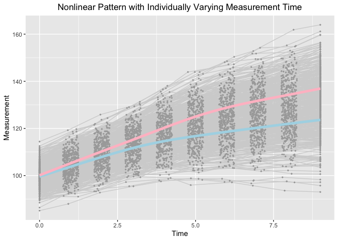

Estimating knots in BLSGMMs in the framework of individual measurement
occasions
================
Jin Liu
2021/11/21

## Require package would be used

``` r
library(OpenMx)
```

    ## OpenMx may run faster if it is compiled to take advantage of multiple cores.

``` r
library(tidyr)
library(ggplot2)
```

## OS, R version and OpenMx Version

``` r
mxOption(model = NULL, key = "Default optimizer", "CSOLNP", reset = FALSE)
mxVersion()
```

    ## OpenMx version: 2.19.6 [GIT v2.19.6]
    ## R version: R version 4.1.0 (2021-05-18)
    ## Platform: x86_64-apple-darwin17.0 
    ## MacOS: 12.0.1
    ## Default optimizer: CSOLNP
    ## NPSOL-enabled?: No
    ## OpenMP-enabled?: No

## “True” values of parameters

``` r
### Class 1
#### Population values of growth factor means
# meanY0 <- c(100, -5, -2.6, 3.5)
### Population values of growth factor var-cov matrix
# psiY0 <- matrix(c(25, 1.5, 1.5, 
#                   1.5, 1.0, 0.3, 
#                   1.5, 0.3, 1.0), nrow = 3)
#### Population values of TIC means
# meanX0 <- c(0, 0)
### Population values of growth factor var-cov matrix
# phi0 <- matrix(c(1, 0.3, 0.3, 1), nrow = 2)
#### Population values of path coefficients
# betaXtoY <- matrix(c(0.88494767, 1.32742186, 
#                      0.17698953, 0.26548430, 
#                      0.17698953, 0.26548430), byrow = T, nrow = 3)
### Class 2
#### Population values of growth factor means
# meanY0 <- c(100, -5, -3.4, 5.5)
#### Population values of growth factor var-cov matrix
# psiY0 <- matrix(c(25, 1.5, 1.5, 
#                   1.5, 1.0, 0.3, 
#                   1.5, 0.3, 1.0), nrow = 3)
#### Population values of TIC means
# meanX0 <- c(0, 0)
#### Population values of growth factor var-cov matrix
# phi0 <- matrix(c(1, 0.3, 0.3, 1), nrow = 2)
#### Population values of path coefficients
# betaXtoY <- matrix(c(1.251505, 1.877258,
#                      0.250301, 0.3754515,
#                      0.250301, 0.3754515), byrow = T, nrow = 3)
### Population values of logistic coefficients
# beta0 <- 0; beta1 <- log(1.5); beta2 <- log(1.7)
```

## Define Parameter lists

``` r
### Bilinear spline with a fixed knot
paraFixed <- c("mueta0", "mueta1", "mueta2", "mug",
               paste0("psi", c("00", "01", "02", "11", "12", "22")),
               "residuals")
```

## Read in dataset for analyses (wide-format data)

``` r
load("BLSGM_uni_sub_dat.RData")
```

## Summarize data

``` r
summary(BLSGM_uni_sub_dat)
```

    ##        id              Y1               Y2               Y3        
    ##  Min.   :  1.0   Min.   : 80.33   Min.   : 76.11   Min.   : 71.05  
    ##  1st Qu.:125.8   1st Qu.: 96.66   1st Qu.: 91.23   1st Qu.: 85.87  
    ##  Median :250.5   Median : 99.89   Median : 94.73   Median : 90.05  
    ##  Mean   :250.5   Mean   :100.00   Mean   : 94.97   Mean   : 89.99  
    ##  3rd Qu.:375.2   3rd Qu.:103.25   3rd Qu.: 98.55   3rd Qu.: 93.69  
    ##  Max.   :500.0   Max.   :116.42   Max.   :108.92   Max.   :105.69  
    ##        Y4               Y5              Y6              Y7       
    ##  Min.   : 63.62   Min.   :58.75   Min.   :52.10   Min.   :46.45  
    ##  1st Qu.: 80.44   1st Qu.:75.89   1st Qu.:71.85   1st Qu.:67.43  
    ##  Median : 84.60   Median :80.40   Median :76.59   Median :72.98  
    ##  Mean   : 84.77   Mean   :80.36   Mean   :76.34   Mean   :72.95  
    ##  3rd Qu.: 89.16   3rd Qu.:85.17   3rd Qu.:81.87   3rd Qu.:78.98  
    ##  Max.   :102.43   Max.   :98.79   Max.   :98.85   Max.   :98.67  
    ##        Y8               Y9              Y10              T1          T2        
    ##  Min.   : 39.06   Min.   : 33.59   Min.   :28.61   Min.   :0   Min.   :0.7520  
    ##  1st Qu.: 63.93   1st Qu.: 60.40   1st Qu.:56.61   1st Qu.:0   1st Qu.:0.8536  
    ##  Median : 69.80   Median : 66.74   Median :63.48   Median :0   Median :0.9953  
    ##  Mean   : 69.73   Mean   : 66.65   Mean   :63.49   Mean   :0   Mean   :0.9936  
    ##  3rd Qu.: 76.13   3rd Qu.: 73.77   3rd Qu.:70.97   3rd Qu.:0   3rd Qu.:1.1276  
    ##  Max.   :100.35   Max.   :100.23   Max.   :99.87   Max.   :0   Max.   :1.2491  
    ##        T3              T4              T5              T6       
    ##  Min.   :1.752   Min.   :2.753   Min.   :3.754   Min.   :4.750  
    ##  1st Qu.:1.867   1st Qu.:2.884   1st Qu.:3.898   1st Qu.:4.871  
    ##  Median :1.998   Median :3.013   Median :4.001   Median :5.011  
    ##  Mean   :1.998   Mean   :3.005   Mean   :4.006   Mean   :5.007  
    ##  3rd Qu.:2.126   3rd Qu.:3.115   3rd Qu.:4.122   3rd Qu.:5.136  
    ##  Max.   :2.249   Max.   :3.249   Max.   :4.249   Max.   :5.249  
    ##        T7              T8              T9             T10   
    ##  Min.   :5.751   Min.   :6.751   Min.   :7.751   Min.   :9  
    ##  1st Qu.:5.878   1st Qu.:6.890   1st Qu.:7.873   1st Qu.:9  
    ##  Median :5.988   Median :7.022   Median :7.999   Median :9  
    ##  Mean   :5.994   Mean   :7.011   Mean   :7.998   Mean   :9  
    ##  3rd Qu.:6.121   3rd Qu.:7.139   3rd Qu.:8.123   3rd Qu.:9  
    ##  Max.   :6.249   Max.   :7.250   Max.   :8.249   Max.   :9  
    ##       gx1                 gx2                ex1                ex2          
    ##  Min.   :-3.379334   Min.   :-3.87034   Min.   :-3.16972   Min.   :-2.86510  
    ##  1st Qu.:-0.808100   1st Qu.:-0.71771   1st Qu.:-0.81168   1st Qu.:-0.68914  
    ##  Median : 0.018376   Median : 0.02739   Median :-0.11460   Median :-0.07459  
    ##  Mean   : 0.006869   Mean   : 0.01487   Mean   :-0.08722   Mean   :-0.02276  
    ##  3rd Qu.: 0.720155   3rd Qu.: 0.76661   3rd Qu.: 0.59728   3rd Qu.: 0.62466  
    ##  Max.   : 3.527651   Max.   : 3.15211   Max.   : 2.77872   Max.   : 3.19017  
    ##     subgroup    
    ##  Min.   :1.000  
    ##  1st Qu.:1.000  
    ##  Median :2.000  
    ##  Mean   :1.534  
    ##  3rd Qu.:2.000  
    ##  Max.   :2.000

## Visualize data

``` r
long_dat_T <- gather(BLSGM_uni_sub_dat, var.T, time, T1:T10)
long_dat_Y <- gather(BLSGM_uni_sub_dat, var.Y, measures, Y1:Y10)
long_dat <- data.frame(id = long_dat_T[, "id"], time = long_dat_T[, "time"],
                       measures = long_dat_Y[, "measures"], class = long_dat_Y[, "subgroup"])
ggplot(aes(x = time, y = measures), data = long_dat) +
  geom_line(aes(group = id), color = "lightgrey", data = long_dat) +
  geom_point(aes(group = id), color = "darkgrey", size = 0.5) +
  geom_smooth(aes(group = 1), size = 1.8, col = "lightblue", se = F, 
              data = long_dat[long_dat$class == 1, ] ) + 
  geom_smooth(aes(group = 1), size = 1.8, col = "pink", se = F, 
              data = long_dat[long_dat$class == 2, ] ) + 
  labs(title = "Nonlinear Pattern with Individually Varying Measurement Time",
       x ="Time", y = "Measurement") + 
  theme(plot.title = element_text(hjust = 0.5))
```

    ## `geom_smooth()` using method = 'gam' and formula 'y ~ s(x, bs = "cs")'
    ## `geom_smooth()` using method = 'gam' and formula 'y ~ s(x, bs = "cs")'

<!-- -->

## Load functions that help calculate initial values

``` r
source("BLSGM_fixed.R")
```

## Bilinear Spline Growth Mixture Model with Unknown Fixed Knots (Stepwise Method)

### First Step

``` r
source("BLSGMM_2steps.R")
BLSGMM_1st <- get_BLSGMM_1st(dat = BLSGM_uni_sub_dat, T_records = 1:10, nClass = 2, traj_var = "Y", t_var = "T", paraNames = paraFixed)
BLSGMM_1st[[3]]
```

    ##           Name Estimate     SE
    ## 1     c1mueta0 100.1981 0.4552
    ## 2     c1mueta1  -5.0929 0.0916
    ## 3     c1mueta2  -3.4247 0.0783
    ## 4        c1mug   5.5083 0.0464
    ## 5      c1psi00  24.6476 3.3238
    ## 6      c1psi01   1.7830 0.4527
    ## 7      c1psi02   1.3169 0.3894
    ## 8      c1psi11   1.0988 0.1229
    ## 9      c1psi12   0.4182 0.0835
    ## 10     c1psi22   0.9665 0.1022
    ## 11 c1residuals   1.0781 0.0402
    ## 12    c2mueta0  99.8225 0.4706
    ## 13    c2mueta1  -5.0196 0.0904
    ## 14    c2mueta2  -2.7793 0.0929
    ## 15       c2mug   3.4490 0.0343
    ## 16     c2psi00  24.0456 3.2753
    ## 17     c2psi01   1.1575 0.4049
    ## 18     c2psi02   1.6048 0.5211
    ## 19     c2psi11   0.9734 0.1168
    ## 20     c2psi12   0.1783 0.0786
    ## 21     c2psi22   0.8664 0.1204
    ## 22 c2residuals   0.9424 0.0377
    ## 23          p2   0.9357 0.1502

### Second Step

``` r
BLSGMM_2nd <- get_BLSGMM_2nd(dat = BLSGM_uni_sub_dat, T_records = 1:10, nClass = 2, traj_var = "Y", t_var = "T", clus_cov = c("gx1", "gx2"),
                             starts = BLSGMM_1st[[2]], beta_starts = matrix(c(0, 0, 0, 0, 1, 1), nrow = 2))
BLSGMM_2nd[[2]]
```

    ##     Name Estimate     SE
    ## 1 beta20  -0.0832 0.1206
    ## 2 beta21  -0.5436 0.1279
    ## 3 beta22   0.4327 0.1301
