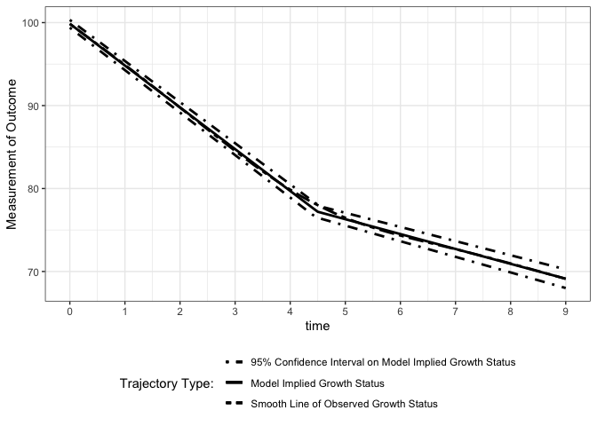

Estimating knots in BLSGMs w/o(w) TICs in the framework of individual
measurement occasions
================
Jin Liu

## Require package would be used

``` r
library(nlpsem)
```

    ## Loading required package: OpenMx

    ## OpenMx may run faster if it is compiled to take advantage of multiple cores.

``` r
OpenMx::mxOption(model = NULL, key = "Default optimizer", "CSOLNP", reset = FALSE)
OpenMx::mxVersion()
```

    ## OpenMx version: 2.21.8 [GIT v2.21.8]
    ## R version: R version 4.2.2 (2022-10-31)
    ## Platform: aarch64-apple-darwin20 
    ## MacOS: 14.4.1
    ## Default optimizer: CSOLNP
    ## NPSOL-enabled?: No
    ## OpenMP-enabled?: No

## Read in dataset for analyses (wide-format data)

``` r
load("BLS_dat.RData")
```

## Model 1: Latent Growth Curve Model with Bilinear Spline Functional Form w/ an Unknown Fixed Knot

### Specify parameters need to be print out

``` r
paraFixed <- c("mueta0", "mueta1", "mueta2", "mug", paste0("psi", c("00", "01", "02", "11", "12", "22")), "residuals")
```

### Fit the model

``` r
BLS_LGCM.r_out <- getLGCM(dat = BLS_dat, t_var = "T", y_var = "Y", curveFun = "BLS", intrinsic = FALSE, records = 1:10, growth_TIC = NULL, res_scale = 0.1,
                          paramOut = TRUE, names = paraFixed)
```

### Visulize longitudinal outcomes

``` r
xstarts <- mean(BLS_dat$T1)
Figure1 <- getFigure(
  model = BLS_LGCM.r_out@mxOutput, nClass = NULL, cluster_TIC = NULL, sub_Model = "LGCM", y_var = "Y", curveFun = "BLS", y_model = "LGCM", 
  t_var = "T", records = 1:10, m_var = NULL, x_var = NULL, x_type = NULL, xstarts = xstarts, xlab = "time", outcome = "Outcome"
)
```

    ## Treating first argument as an object that stores a character

``` r
show(Figure1)
```

    ## figOutput Object
    ## --------------------
    ## Trajectories: 1 
    ## Figure 1:

    ## `geom_smooth()` using method = 'gam' and formula = 'y ~ s(x, bs = "cs")'

<!-- -->

## Model 2: Latent Growth Curve Model with Bilinear Spline Functional Form w/ an Unknown Random Knot

### Specify parameters need to be print out

``` r
paraRandom <- c("mueta0", "mueta1", "mueta2", "mug", paste0("psi", c("00", "01", "02", "0g", "11", "12", "1g", "22", "2g", "gg")), "residuals")
```

### Fit the model

``` r
BLS_LGCM.f_out <- getLGCM(dat = BLS_dat, t_var = "T", y_var = "Y", curveFun = "BLS", intrinsic = TRUE, records = 1:10, growth_TIC = NULL, res_scale = 0.1,
                          paramOut = TRUE, names = paraRandom)
```

### Visulize longitudinal outcomes

``` r
xstarts <- mean(BLS_dat$T1)
Figure2 <- getFigure(
  model = BLS_LGCM.f_out@mxOutput, nClass = NULL, cluster_TIC = NULL, sub_Model = "LGCM", y_var = "Y", curveFun = "BLS", y_model = "LGCM", 
  t_var = "T", records = 1:10, m_var = NULL, x_var = NULL, x_type = NULL, xstarts = xstarts, xlab = "time", outcome = "Outcome"
)
```

    ## Treating first argument as an object that stores a character

``` r
show(Figure2)
```

    ## figOutput Object
    ## --------------------
    ## Trajectories: 1 
    ## Figure 1:

    ## `geom_smooth()` using method = 'gam' and formula = 'y ~ s(x, bs = "cs")'

<!-- -->

## Likelihood Ratio Test between Model 1 and Model 2

``` r
getLRT(
  full = BLS_LGCM.f_out@mxOutput, reduced = BLS_LGCM.r_out@mxOutput, boot = FALSE, rep = NA
  )
```

    ##               # of Free Param -2loglik Degree of Freedom Diff in loglik
    ## Full Model                 15 20077.53              4985             NA
    ## Reduced Model              11 20143.89              4989        66.3598
    ##               Diff in DoF p.values      AIC      BIC
    ## Full Model             NA     <NA> 20107.53 20170.75
    ## Reduced Model           4  <0.0001 20165.89 20212.25

## Model 3: Latent Growth Curve Model with Bilinear Spline Functional Form w/ TICs and an Unknown Fixed Knot

### Specify parameters need to be print out

``` r
paraFixedTIC <- c("alpha0", "alpha1", "alpha2", "mu_knot", paste0("psi", c("00", "01", "02", "11", "12", "22")), "residuals", 
                  paste0("beta1", 0:2), paste0("beta2", 0:2), paste0("mux", 1:2), paste0("phi", c("11", "12", "22")),
                  "mueta0", "mueta1", "mueta2")
```

### Fit the model

``` r
BLS_LGCM.TIC.r_out <- getLGCM(dat = BLS_dat, t_var = "T", y_var = "Y", curveFun = "BLS", intrinsic = FALSE, records = 1:10, growth_TIC = c("ex1", "ex2"), 
                              res_scale = 0.1, paramOut = TRUE, names = paraFixedTIC)
```

### Visulize longitudinal outcomes

``` r
xstarts <- mean(BLS_dat$T1)
Figure3 <- getFigure(
  model = BLS_LGCM.TIC.r_out@mxOutput, nClass = NULL, cluster_TIC = NULL, sub_Model = "LGCM", y_var = "Y", curveFun = "BLS", y_model = "LGCM", 
  t_var = "T", records = 1:10, m_var = NULL, x_var = NULL, x_type = NULL, xstarts = xstarts, xlab = "time", outcome = "Outcome"
)
```

    ## Treating first argument as an object that stores a character
    ## Treating first argument as an object that stores a character
    ## Treating first argument as an object that stores a character

``` r
show(Figure3)
```

    ## figOutput Object
    ## --------------------
    ## Trajectories: 1 
    ## Figure 1:

    ## `geom_smooth()` using method = 'gam' and formula = 'y ~ s(x, bs = "cs")'

<!-- -->

## Model 4: Latent Growth Curve Model with Bilinear Spline Functional Form w/ TICs and an Unknown Random Knot

### Specify parameters need to be print out

``` r
paraRandomTIC <- c("alpha0", "alpha1", "alpha2", "alphag", paste0("psi", c("00", "01", "02", "0g", "11", "12", "1g", "22", "2g", "gg")), "residuals", 
                   paste0("beta1", c(0:2, "g")), paste0("beta2", c(0:2, "g")), paste0("mux", 1:2), paste0("phi", c("11", "12", "22")),
                   "mueta0", "mueta1", "mueta2", "mu_knot")
```

### Fit the model

``` r
BLS_LGCM.TIC.f_out <- getLGCM(dat = BLS_dat, t_var = "T", y_var = "Y", curveFun = "BLS", intrinsic = TRUE, records = 1:10, growth_TIC = c("ex1", "ex2"),
                              res_scale = 0.1, paramOut = TRUE, names = paraRandomTIC)
```

### Visulize longitudinal outcomes

``` r
xstarts <- mean(BLS_dat$T1)
Figure4 <- getFigure(
  model = BLS_LGCM.TIC.f_out@mxOutput, nClass = NULL, cluster_TIC = NULL, sub_Model = "LGCM", y_var = "Y", curveFun = "BLS", y_model = "LGCM", 
  t_var = "T", records = 1:10, m_var = NULL, x_var = NULL, x_type = NULL, xstarts = xstarts, xlab = "time", outcome = "Outcome"
)
```

    ## Treating first argument as an object that stores a character

``` r
show(Figure4)
```

    ## figOutput Object
    ## --------------------
    ## Trajectories: 1 
    ## Figure 1:

    ## `geom_smooth()` using method = 'gam' and formula = 'y ~ s(x, bs = "cs")'

<!-- -->

## Likelihood Ratio Test between Model 3 and Model 4

``` r
getLRT(
  full = BLS_LGCM.TIC.f_out@mxOutput, reduced = BLS_LGCM.TIC.r_out@mxOutput, boot = FALSE, rep = NA
  )
```

    ##               # of Free Param -2loglik Degree of Freedom Diff in loglik
    ## Full Model                 28 22756.46              5972             NA
    ## Reduced Model              22 22827.79              5978       71.32416
    ##               Diff in DoF p.values      AIC      BIC
    ## Full Model             NA     <NA> 22812.46 22930.47
    ## Reduced Model           6  <0.0001 22871.79 22964.51
