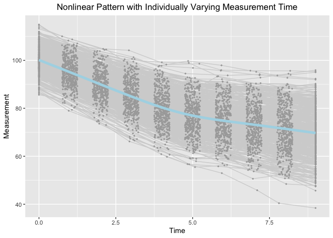

Estimating knots in BLSGMs w/o(w) TICs in the framework of individual measurement occasions
================
Jin Liu
2019/10/03

OS and R version
----------------

``` r
R.version
```

    ##                _                           
    ## platform       x86_64-apple-darwin15.6.0   
    ## arch           x86_64                      
    ## os             darwin15.6.0                
    ## system         x86_64, darwin15.6.0        
    ## status                                     
    ## major          3                           
    ## minor          6.1                         
    ## year           2019                        
    ## month          07                          
    ## day            05                          
    ## svn rev        76782                       
    ## language       R                           
    ## version.string R version 3.6.1 (2019-07-05)
    ## nickname       Action of the Toes

Require package would be used and rjags version
-----------------------------------------------

``` r
library(tidyr)
library(ggplot2)
library(rjags)
```

    ## Loading required package: coda

    ## Linked to JAGS 4.3.0

    ## Loaded modules: basemod,bugs

Read in dataset for analyses (wide-format data)
-----------------------------------------------

``` r
dat <- read.csv(file = "example_data.csv")
```

Summarize data
--------------

``` r
summary(dat)
```

    ##        id              Y1               Y2               Y3        
    ##  Min.   :  1.0   Min.   : 85.62   Min.   : 78.98   Min.   : 73.05  
    ##  1st Qu.:125.8   1st Qu.: 96.84   1st Qu.: 91.31   1st Qu.: 86.10  
    ##  Median :250.5   Median : 99.95   Median : 94.95   Median : 89.68  
    ##  Mean   :250.5   Mean   :100.14   Mean   : 95.10   Mean   : 90.04  
    ##  3rd Qu.:375.2   3rd Qu.:103.42   3rd Qu.: 98.75   3rd Qu.: 94.24  
    ##  Max.   :500.0   Max.   :114.93   Max.   :110.01   Max.   :104.79  
    ##        Y4               Y5              Y6              Y7       
    ##  Min.   : 66.18   Min.   :59.76   Min.   :55.48   Min.   :52.96  
    ##  1st Qu.: 80.69   1st Qu.:75.04   1st Qu.:71.45   1st Qu.:69.43  
    ##  Median : 84.89   Median :79.78   Median :76.59   Median :74.64  
    ##  Mean   : 85.13   Mean   :80.06   Mean   :76.73   Mean   :75.03  
    ##  3rd Qu.: 89.97   3rd Qu.:84.97   3rd Qu.:82.02   3rd Qu.:80.35  
    ##  Max.   :104.17   Max.   :99.16   Max.   :99.71   Max.   :97.90  
    ##        Y8              Y9             Y10              T1   
    ##  Min.   :45.82   Min.   :40.42   Min.   :38.43   Min.   :0  
    ##  1st Qu.:67.01   1st Qu.:64.77   1st Qu.:62.87   1st Qu.:0  
    ##  Median :73.03   Median :71.75   Median :69.77   Median :0  
    ##  Mean   :73.29   Mean   :71.39   Mean   :69.72   Mean   :0  
    ##  3rd Qu.:79.15   3rd Qu.:77.86   3rd Qu.:76.72   3rd Qu.:0  
    ##  Max.   :95.68   Max.   :95.62   Max.   :95.90   Max.   :0  
    ##        T2               T3              T4              T5       
    ##  Min.   :0.7504   Min.   :1.751   Min.   :2.750   Min.   :3.750  
    ##  1st Qu.:0.8691   1st Qu.:1.886   1st Qu.:2.885   1st Qu.:3.891  
    ##  Median :1.0158   Median :2.007   Median :2.998   Median :4.008  
    ##  Mean   :1.0056   Mean   :2.002   Mean   :3.002   Mean   :4.007  
    ##  3rd Qu.:1.1279   3rd Qu.:2.117   3rd Qu.:3.119   3rd Qu.:4.137  
    ##  Max.   :1.2493   Max.   :2.250   Max.   :3.250   Max.   :4.250  
    ##        T6              T7              T8              T9       
    ##  Min.   :4.751   Min.   :5.751   Min.   :6.751   Min.   :7.750  
    ##  1st Qu.:4.867   1st Qu.:5.855   1st Qu.:6.869   1st Qu.:7.891  
    ##  Median :4.990   Median :5.999   Median :6.995   Median :8.034  
    ##  Mean   :4.993   Mean   :5.990   Mean   :6.996   Mean   :8.015  
    ##  3rd Qu.:5.123   3rd Qu.:6.116   3rd Qu.:7.125   3rd Qu.:8.141  
    ##  Max.   :5.248   Max.   :6.250   Max.   :7.249   Max.   :8.250  
    ##       T10          x1                 x2          
    ##  Min.   :9   Min.   :-2.75128   Min.   :-3.42053  
    ##  1st Qu.:9   1st Qu.:-0.62326   1st Qu.:-0.59155  
    ##  Median :9   Median : 0.03191   Median : 0.05391  
    ##  Mean   :9   Mean   : 0.04213   Mean   : 0.03263  
    ##  3rd Qu.:9   3rd Qu.: 0.68883   3rd Qu.: 0.73213  
    ##  Max.   :9   Max.   : 2.61251   Max.   : 2.38615

Visualize data
--------------

``` r
long_dat_T <- gather(dat, var.T, time, T1:T10)
long_dat_Y <- gather(dat, var.Y, measures, Y1:Y10)
long_dat <- data.frame(id = long_dat_T[, 1], time = long_dat_T[, 15],
                       measures = long_dat_Y[, 15])
ggplot(aes(x = time, y = measures), data = long_dat) +
  geom_line(aes(group = id), color = "lightgrey") +
  geom_point(aes(group = id), color = "darkgrey", size = 0.5) +
  geom_smooth(aes(group = 1), size = 1.8, col = "lightblue", se = F) + 
  labs(title = "Nonlinear Pattern with Individually Varying Measurement Time",
       x ="Time", y = "Measurement") + 
  theme(plot.title = element_text(hjust = 0.5))
```

    ## `geom_smooth()` using method = 'gam' and formula 'y ~ s(x, bs = "cs")'



Bilinear Spline Growth Model with an Unknown Fixed Knot
-------------------------------------------------------

``` r
load("RjagsFixed_out.Rdata")
### Check if the model if converged (Rhat)
ifConverge
```

    ## [1] "Converge"

``` r
### Check effect size
coda::effectiveSize(FixedOut0)
```

    ##        gamma    muetas[1]    muetas[2]    muetas[3] psietas[1,1] 
    ##     2771.086    26694.224    19676.025    30000.000    30215.361 
    ## psietas[2,1] psietas[3,1] psietas[1,2] psietas[2,2] psietas[3,2] 
    ##    30000.000    30000.000    30000.000    29685.673    29603.160 
    ## psietas[1,3] psietas[2,3] psietas[3,3]     theta_sq 
    ##    30000.000    29603.160    29492.015    29805.699

``` r
### Mean and 95% posterior credible interval
BLSGM_Fixed.Out
```

    ##                est      lower      upper  true
    ## mueta0 100.1285812 99.6732769 100.580629 100.0
    ## mueta1  -5.0071824 -5.0973991  -4.916262  -5.0
    ## mueta2  -1.7596152 -1.8517488  -1.666959  -1.8
    ## gamma    4.4901515  4.4572127   4.523752   4.5
    ## psi00   26.4268114 23.3153215  29.950664  25.0
    ## psi11    0.9648641  0.8439101   1.101416   1.0
    ## psi22    1.0315549  0.9027914   1.176710   1.0

Bilinear Spline Growth Model with an Unknown Random Knot
--------------------------------------------------------

``` r
rm(list = ls())
load("RjagsRandom_out.Rdata")
### Check if the model if converged (Rhat)
ifConverge
```

    ## [1] "Converge"

``` r
### Check effect size
coda::effectiveSize(RandomOut0)
```

    ##        gamma    muetas[1]    muetas[2]    muetas[3] psietas[1,1] 
    ##     246.9975   19090.4253    3431.9833   23152.9652   20636.6057 
    ## psietas[2,1] psietas[3,1] psietas[4,1] psietas[1,2] psietas[2,2] 
    ##   23362.1990   16294.2098    3598.1921   23362.1990   16681.1698 
    ## psietas[3,2] psietas[4,2] psietas[1,3] psietas[2,3] psietas[3,3] 
    ##   18190.8364    3487.0715   16294.2098   18190.8364   17020.3555 
    ## psietas[4,3] psietas[1,4] psietas[2,4] psietas[3,4] psietas[4,4] 
    ##    1613.9606    3598.1921    3487.0715    1613.9606    1999.1774 
    ##     theta_sq 
    ##   10713.1651

``` r
### Mean and 95% posterior credible interval
BLSGM_Random.Out
```

    ##                 est       lower       upper   true
    ## mueta0 100.19572544 99.74358220 100.6531355 100.00
    ## mueta1  -5.00847999 -5.10016869  -4.9175966  -5.00
    ## mueta2  -1.76093175 -1.85672895  -1.6658333  -1.80
    ## gamma    4.48409717  4.43775396   4.5297410   4.50
    ## psi00   25.90529544 22.80031282  29.3957746  25.00
    ## psi11    1.01332789  0.88443009   1.1600160   1.00
    ## psi22    1.08868958  0.95185465   1.2458016   1.00
    ## psirr    0.08017131  0.05713538   0.1068597   0.09

Bilinear Spline Growth Model-TICs with an Unknown Fixed Knot
------------------------------------------------------------

``` r
rm(list = ls())
load("RjagsFixed_TIC_out.Rdata")
### Check if the model if converged (Rhat)
ifConverge
```

    ## [1] "Converge"

``` r
### Check effect size
coda::effectiveSize(Fixed_TICOut0)
```

    ##      alpha0s      alpha1s      alpha2s      beta01s      beta02s 
    ##    24260.448    18704.888    28734.242    27101.197    28164.934 
    ##      beta11s      beta12s      beta21s      beta22s        gamma 
    ##    28095.594    30895.284    29634.417    29685.874     2733.548 
    ## psietas[1,1] psietas[2,1] psietas[3,1] psietas[1,2] psietas[2,2] 
    ##    30000.000    30000.000    30000.000    30000.000    30000.000 
    ## psietas[3,2] psietas[1,3] psietas[2,3] psietas[3,3]     theta_sq 
    ##    29407.272    30000.000    29407.272    30889.533    30000.000

``` r
### Mean and 95% posterior credible interval
BLSGM_TICs_Fixed.Out
```

    ##                est       lower       upper        true
    ## mueta0 100.0112923 99.57609860 100.4421018 100.0000000
    ## mueta1  -5.0274684 -5.11556336  -4.9405748  -5.0000000
    ## mueta2  -1.7749593 -1.86549710  -1.6839910  -1.8000000
    ## gamma    4.4909563  4.45727404   4.5247673   4.5000000
    ## psi00   23.8717055 20.98561248  27.0588248  21.7500000
    ## psi11    0.9028358  0.79063420   1.0312144   0.8700000
    ## psi22    0.9511784  0.83071290   1.0867667   0.8700000
    ## beta01   0.6415831  0.17345346   1.1132344   0.8849477
    ## beta11   0.1318355  0.03765787   0.2234697   0.1769895
    ## beta21   0.1413361  0.04604023   0.2363163   0.1769895
    ## beta02   1.4746571  1.00726424   1.9467366   1.3274219
    ## beta12   0.2108560  0.11676256   0.3069212   0.2654843
    ## beta22   0.2451065  0.14921241   0.3418140   0.2654843

Bilinear Spline Growth Model-TICs with an Unknown Random Knot
-------------------------------------------------------------

``` r
rm(list = ls())
load("RjagsRandom_TIC_out.Rdata")
### Check if the model if converged (Rhat)
ifConverge
```

    ## [1] "Converge"

``` r
### Check effect size
coda::effectiveSize(Random_TICOut0)
```

    ##      alpha0s      alpha1s      alpha2s      beta01s      beta02s 
    ##    9227.3711    2941.7894   22030.3205   23456.4750   22464.5229 
    ##      beta11s      beta12s      beta21s      beta22s      betar1s 
    ##   18604.3779   19819.9799   22001.3056   21288.3066    3926.0699 
    ##      betar2s        gamma psietas[1,1] psietas[2,1] psietas[3,1] 
    ##    4027.9727     220.7923   15661.3484   20067.2261   16525.3715 
    ## psietas[4,1] psietas[1,2] psietas[2,2] psietas[3,2] psietas[4,2] 
    ##    2782.0155   20067.2261   14336.3759   17499.5899    3209.0889 
    ## psietas[1,3] psietas[2,3] psietas[3,3] psietas[4,3] psietas[1,4] 
    ##   16525.3715   17499.5899   17168.6420    1232.7216    2782.0155 
    ## psietas[2,4] psietas[3,4] psietas[4,4]     theta_sq 
    ##    3209.0889    1232.7216    1893.5293   10534.8712

``` r
### Mean and 95% posterior credible interval
BLSGM_TICs_Random.Out
```

    ##                 est       lower       upper         true
    ## mueta0 100.07985172 99.64408265 100.5175649 100.00000000
    ## mueta1  -5.03140523 -5.11969580  -4.9423449  -5.00000000
    ## mueta2  -1.77978655 -1.86952502  -1.6883216  -1.80000000
    ## gamma    4.47610561  4.42844561   4.5243483   4.50000000
    ## psi00   23.63242202 20.81018105  26.8900258  21.75000000
    ## psi11    0.92104617  0.80160338   1.0534008   0.87000000
    ## psi22    0.97815735  0.85258641   1.1205095   0.87000000
    ## psirr    0.07066359  0.04992025   0.0949917   0.07830000
    ## beta01   0.59481001  0.12996070   1.0630935   0.88494767
    ## beta02   0.16850659  0.07296245   0.2641774   0.17698953
    ## beta11   0.17987901  0.08127733   0.2783504   0.17698953
    ## beta12   0.07619923  0.03119405   0.1211087   0.05309687
    ## beta21   1.43424993  0.95827316   1.8999226   1.32742186
    ## beta22   0.24026908  0.14375138   0.3366028   0.26548430
    ## betar1   0.27549649  0.17708066   0.3754823   0.26548430
    ## betar2   0.06055685  0.01514023   0.1057048   0.07964533
